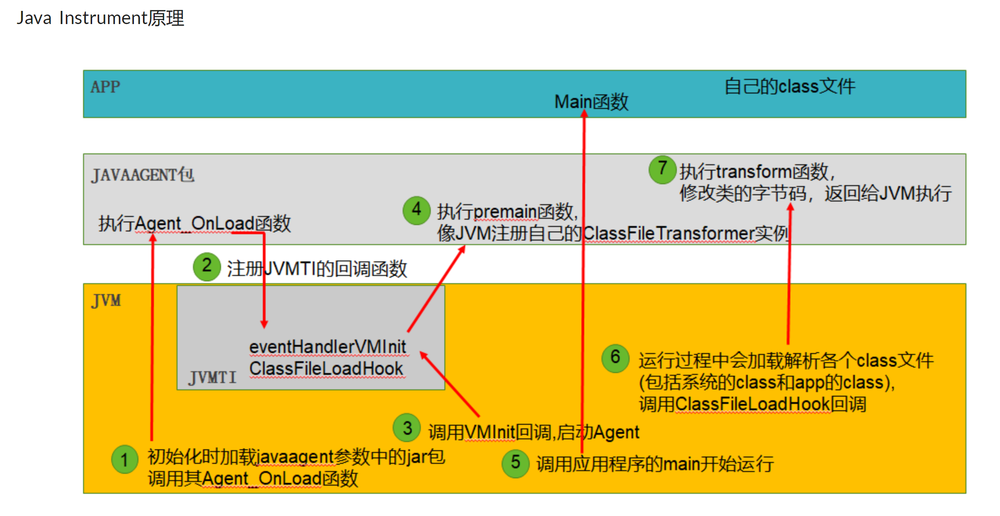
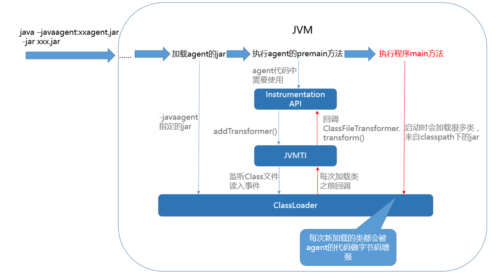
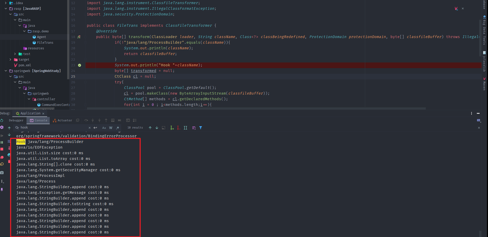

- [RASP(Runtime application self-protection)](#raspruntime-application-self-protection)
  - [与WAF的区别](#与waf的区别)
  - [实现方式](#实现方式)
    - [注入方法(JAVA)](#注入方法java)
    - [Java Instrumentation()](#java-instrumentation)
      - [JAVA Agent](#java-agent)
      - [修改字节码](#修改字节码)
      - [Demo](#demo)
      - [Attack API](#attack-api)
  - [BypassRASP](#bypassrasp)
    - [新开线程执行](#新开线程执行)
    - [反射修改RASP全局变量](#反射修改rasp全局变量)
    - [Hook不严谨](#hook不严谨)
    - [规则不严谨](#规则不严谨)
    - [使用更底层的调用](#使用更底层的调用)
      - [JNI技术](#jni技术)
      - [劫持GOT表](#劫持got表)
  - [参考](#参考)
# RASP(Runtime application self-protection)
应用运行时自我保护,简单来说是将RASP实现的自身注入到应用程序中,在应用程序运行时根据一定的规则对某些行为(敏感方法的调用)进行监控和判断,根据运行时的应用的各项数据(传入的参数等等)进行判断,如果判断为危险操作则进行告警和拦截.
## 与WAF的区别
无论是云WAF和硬件WAF都是对HTTP流量进行规则匹配,容易出现各种绕过(规则不全,只能防已知漏洞,各种业务中数据复杂无法正确识别请求数据误报高,WAF自身存在设计语言缺陷等).  

而RASP是嵌入业务代码中对相关敏感方法进行防护,无论在HTTP层做什么样的变形,加密,编码还是0day等,在最后进行漏洞利用时其传入危险方法的参数都会被还原为原始的状态.

还有一些其它优点,比如对业务影响较小,RASP只在敏感方法被调用时触发,而WAF会对每个业务请求进行检测,降低了业务效率等等.
## 实现方式
### 注入方法(JAVA)
主要有几种方式来将RASP注入到应用本身.
* 在源码层面注入RASP:该方法一般使用静态代理的方式,但灵活性很差,需要在原代码的基础上进行修改.
* 在字节码加载后进行注入RASP,这种方式一般使用动态代理的方式,但该方法需要将动态代理的相关代理加入到源码中,那么每次业务代码编译时都要编译一次动态代理的代码.
* 在字节码加载前进行注入RASP,这种方法将RASP代码和业务代码分离,一般来说利用JDK5加的Instrumentation特性来对相关方法进行Hook添加添加逻辑,这样对业务代码来说无感,适用性高,还有一种方式修改ClassLoader,但该方式也会修改到业务代码,灵活性不高.  
  
所以RASP主要的的两个核心点在于:
1. 利用JAVA Instrumentation从JVM获取所需要的信息.
2. 修改相关字节码注入检测逻辑.

###  Java Instrumentation()
Java Instrumentation(JAVA 仪表)指java.lang.instrument包,里面提供了一些检测和协助JVM中运行程序的方法,其实现基于JVMTI(Java Virtual Machine Tool Interface)提供的相关编程接口,JVMTI基于事件驱动,当jvm执行到满足条件的逻辑时就会去调用事件的回调接口,然后开发者通过实现这些回调接口可以实现自己的逻辑. 
  
java.lang.instrument.Instrumentation常见方法.
```java
public interface Instrumentation {
    /**
     * 注册一个Transformer，从此之后的类加载都会被Transformer拦截。
     * Transformer可以直接对类的字节码byte[]进行修改
     */
    void addTransformer(ClassFileTransformer transformer);
    
    /**
     * 对JVM已经加载的类重新触发类加载。使用的就是上面注册的Transformer。
     * retransformation可以修改方法体，但是不能变更方法签名、增加和删除方法/类的成员属性
     */
    void retransformClasses(Class<?>... classes) throws UnmodifiableClassException;
    
    /**
     * 获取一个对象的大小
     */
    long getObjectSize(Object objectToSize);
    
    /**
     * 将一个jar加入到bootstrap classloader的 classpath里
     */
    void appendToBootstrapClassLoaderSearch(JarFile jarfile);
    
    /**
     * 获取当前被JVM加载的所有类对象
     */
    Class[] getAllLoadedClasses();
}
```
#### JAVA Agent
而想要在不修改源码的情况下注入Instrumentation实例还需要通过Java Agent实现. 

Java agent是一种特殊的Java程序（Jar文件），它是Instrumentation的客户端。与普通Java程序通过main方法启动不同，agent并不是一个可以单独启动的程序，而必须依附在一个Java应用程序（JVM）上，与它运行在同一个进程中，通过Instrumentation API与虚拟机交互。

Java agent与Instrumentation密不可分，二者也需要在一起使用。因为Instrumentation的实例会作为参数注入到Java agent的启动方法中。  
agent加载时,jar包会被加入到system class path中被system class loader进行加载,而agent的启动方式有两种,即VM启动时加载或者VM启动后加载.  
* 在启动时加载: 通过vm的-javaagent: *.jar指定jar包路径  

对于VM启动时加载的Java agent,其premain方法会在程序main方法执行之前被调用，此时大部分Java类都没有被加载(agent类本身和它依赖的类还是会先加载的),如果此时premain方法执行失败或抛出异常，那么JVM的启动会被终止。
```java
/**
 * 以vm参数的形式载入，在程序main方法执行之前执行
 * 其jar包的manifest需要配置属性Premain-Class
 */
public static void premain(String agentArgs, Instrumentation inst);
/**
``` 


* 在启动后加载: 在vm启动后通过attach api动态启动agent.  

对于VM启动后加载的Java agent，其agentmain方法会在加载之时立即执行。如果agentmain执行失败或抛出异常，JVM会忽略掉错误，不会影响到正在running的Java程序。

```java
 * 以Attach的方式载入，在Java程序启动后执行
 * 其jar包的manifest需要配置属性Agent-Class
 */
public static void agentmain(String agentArgs, Instrumentation inst);

```  
#### 修改字节码
因为是在字节码加载前注入RASP,也就是说我们的RASP进行HOOK的方式是需要对业务代码的字节码进行修改来实现Instrumentation.而对于Instrumentation实现方式也有几种途径,主要就是几种操作字节码的类库,如 Javassist,ASM,CGLIB,BCEL等等.
#### Demo
比如Hook常见的命令执行使用的ProcessBuilder类. 
```java
@RestController
public class CommandExecController {
    @RequestMapping("/command")
        public String command(@RequestParam String cmd) throws IOException {
        return Runtime.getRuntime().exec(cmd).getOutputStream().toString();
    }
}
```
Instrumentation实现
```java
package rasp.demo;

import javassist.CannotCompileException;
import javassist.ClassPool;
import javassist.CtClass;
import javassist.CtMethod;
import javassist.expr.ExprEditor;
import javassist.expr.MethodCall;

import java.io.ByteArrayInputStream;
import java.io.IOException;
import java.io.UnsupportedEncodingException;
import java.lang.instrument.ClassFileTransformer;
import java.lang.instrument.IllegalClassFormatException;
import java.lang.instrument.Instrumentation;
import java.net.URL;
import java.net.URLDecoder;
import java.nio.charset.StandardCharsets;
import java.security.ProtectionDomain;
import java.util.jar.JarFile;

public class Agent {
    public static  void premain(String args, Instrumentation inst){
        try {
            //将Java agent的jar包加入到BootStrap class path中，在类加载时可以保证加载顺序位于最顶层,如果不进行特殊设定，则会默认将jar包加入到System class path中,这样则拦截不到系统类.
            addJarToBootstrap(inst);
        } catch (IOException e) {
            e.printStackTrace();
        }
        ClassFileTransformer classFileTransformer =   new FileTrans();
        inst.addTransformer(classFileTransformer);
    }


    public static  void addJarToBootstrap(Instrumentation inst) throws IOException {
        String localJarPath = getLocalJarPath();
        inst.appendToBootstrapClassLoaderSearch(new JarFile(localJarPath));
    }

    public static String getLocalJarPath() throws UnsupportedEncodingException {
        URL localUrl = Agent.class.getProtectionDomain().getCodeSource().getLocation();
        String path;
        path = URLDecoder.decode(
                localUrl.getFile().replace("+", "%2B"), String.valueOf(StandardCharsets.UTF_8));
        return path;
    }

}

```  
可以看到在这里还调用了Instrumentation的appendToBootstrapClassLoaderSearch方法,这是因为默认情况用户自定义的包是被应用加载器加载的,而系统类是由BootStrap加载器进行加载的,如果需要在系统类里面调用应用加载器加载的用户类则会违背双亲委派机制,所以将Rasp包手动让BootStrap加载器进行加载来避免这个问题.  
```java
package rasp.demo;

import javassist.CannotCompileException;
import javassist.ClassPool;
import javassist.CtClass;
import javassist.CtMethod;
import javassist.expr.ExprEditor;
import javassist.expr.MethodCall;

import java.io.ByteArrayInputStream;
import java.io.IOException;
import java.lang.instrument.ClassFileTransformer;
import java.lang.instrument.IllegalClassFormatException;
import java.security.ProtectionDomain;

public class FileTrans implements ClassFileTransformer {
    @Override
    public byte[] transform(ClassLoader loader, String className, Class<?> classBeingRedefined, ProtectionDomain protectionDomain, byte[] classfileBuffer) throws IllegalClassFormatException {
            if(!"java/lang/ProcessBuilder".equals(className)){
                System.out.println(className);
                return classfileBuffer;
            }
            System.out.println("Hook "+className);
            byte[] transformed = null;
            CtClass cl = null;
            try{
                ClassPool pool = ClassPool.getDefault();
                cl = pool.makeClass(new ByteArrayInputStream(classfileBuffer));
                CtMethod[] methods = cl.getDeclaredMethods();
                for(int i = 0 ; i<methods.length;i++){
                    methods[i].instrument(new ExprEditor(){
                        @Override
                        public void edit(MethodCall m) throws CannotCompileException {
                            m.replace("{ long stime = System.currentTimeMillis();"
                                    + " $_ = $proceed($$);"
                                    + "System.out.println(\"" + m.getClassName() + "." + m.getMethodName()
                                    + " cost:\" + (System.currentTimeMillis() - stime) + \" ms\"); }");
                        }
                    });
                }
                transformed = cl.toBytecode();
            } catch (IOException | CannotCompileException e) {
                e.printStackTrace();
            }finally {
                if(cl !=null){
                    cl.detach();
                }
            }
            return transformed;
        }
    }
```
当执行http://localhost:8080/command?cmd=ls,就会触发Hook.
  
可以看到的是Hook ProcessBuilder类时并不是在启动时就Hook,而是在实际执行时才触发Hook,这是因为JAVA类加载是动态加载的,并不会在初始化时就把全部类加载进JVM,而这个时候ProcessByulder类才被加载进来,触发Hook.  
  
在实际的RASP开发中,就需要对各类敏感方法进行Hook,对其参数进行检测进行防御.
#### Attack API
另一种通过Attack API可以实现再JVM启动后再进行加载,，Attach API其实是跨JVM进程通讯的工具，能够将某种指令从一个JVM进程发送给另一个JVM进程。
 由于是进程间通讯，那代表着使用Attach API的程序需要是一个独立的Java程序，通过attach目标进程，与其进行通讯。下面的代码表示了向另一个进程JVM发起通讯，加载一个名为agent.jar的Java agent.
```java
// VirtualMachine等相关Class位于JDK的tools.jar
VirtualMachine vm = VirtualMachine.attach("1234");  // 1234表示目标JVM进程pid
try {
    vm.loadAgent(".../agent.jar");    // 指定agent的jar包路径，发送给目标进程
} finally {
    vm.detach();
}
```
vm.loadAgent之后，相应的agent就会被目标JVM进程加载，并执行agentmain方法。
## BypassRASP
### 新开线程执行
RASP如果根据HTTP请求来进行检测,会对HTTP请求的一些变量进行检测再决定是否拦截检测,但直接新起一个线程执行的话则上下文没有HTTP请求的相关变量,导致RASP不检测而绕过.
### 反射修改RASP全局变量
RASP一般会有一些全局变量的设置,可以通过反射获取到存有全局变量的相关类,直接修改Hook启动相关变量,将RASP直接关闭.
### Hook不严谨
大部分请求我们执行命令都是使用的`Rumtime.getRuntime().exec()`来执行命令,所有有些RASP则只Hook`java.lang.Runtime`这个类,然而其实Runtime类最后执行命令是调用的Processbuilder类的方法创建进程执行命令,这就导致可以直接new Processbuilder类直接执行命令,类似如果Hook点不够底层的话都有可能被绕过.
### 规则不严谨
说到底,RASP也是根据人写的规则进行拦截,只是是在函数调用时进行拦截,可以保证拿到的参数都是原始的参数,但如果检测的规则不严谨,有问题,那么规则自身本来就有缺陷也是可能被绕过的.  
### 使用更底层的调用
#### JNI技术
JNI是Java Native Interface的缩写，通过使用 Java本地接口书写程序，可以确保代码在不同的平台上方便移植。从Java1.1开始，JNI标准成为java平台的一部分，它允许Java代码和其他语言写的代码进行交互。  
* Java程序中的函数调用Native程序中的函数。Native一般指使用C/C++编写的函数。
* Native程序中的函数调用Java程序中的函数。
将敏感方法通过C/C++在DLL中实现来调用执行即可绕过RASP的检测.
#### 劫持GOT表
https://mp.weixin.qq.com/s?__biz=MzIzOTE1ODczMg==&mid=2247484822&idx=1&sn=71b04c0a08fee2cb239ff78a5e7a6165  
## 参考
http://blog.nsfocus.net/rasp-tech/  
http://blog.nsfocus.net/openrasp-tech/  
https://rasp.baidu.com/  
https://paper.seebug.org/330/#0x01-rasp  
https://paper.seebug.org/513/  
https://paper.seebug.org/1041/#0x06  
http://www.fanyilun.me/2017/07/18/%e8%b0%88%e8%b0%88Java%20Intrumentation%e5%92%8c%e7%9b%b8%e5%85%b3%e5%ba%94%e7%94%a8/  
https://mp.weixin.qq.com/s/sy8Td8OsWJVaqqa0H4_kKA    
https://www.anquanke.com/post/id/241107  
https://landgrey.me/blog/15/  
https://mp.weixin.qq.com/s?__biz=MzA5Mzg3NTUwNQ==&mid=2447804425&idx=1&sn=91515259ee4d8a204d40e0aee8177f58