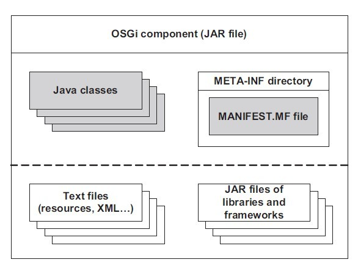
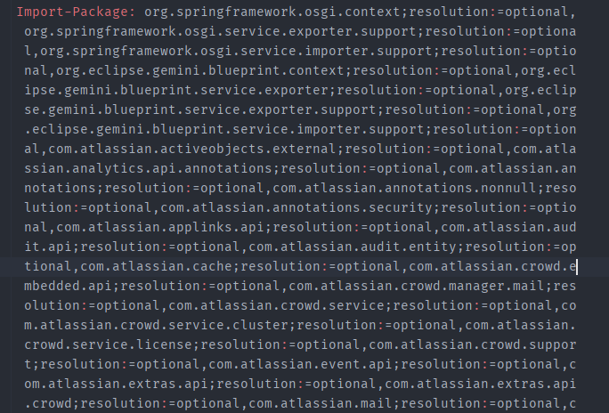

- [OSGI模型](#osgi模型)
  - [JAVA OSGI](#java-osgi)
    - [Bundle](#bundle)
    - [代码访问机制](#代码访问机制)
      - [ClassPath](#classpath)
      - [Export-Package](#export-package)
      - [Import-Package](#import-package)
      - [DynamicImport-Package](#dynamicimport-package)
      - [Require-Bundle](#require-bundle)
      - [依赖匹配](#依赖匹配)
      - [Class的搜索顺序](#class的搜索顺序)
      - [BundleContext](#bundlecontext)
      - [OSGI Service](#osgi-service)
  - [参考](#参考)
# OSGI模型
OSGI模型主要用于将文件在物理上模块上进行分离,即物理模块化,从表现形式来看即将类文件被放在不同的模块文件包中,但模块之前的访问并不受物理模块化的影响,访问逻辑只跟对象的访问修饰符相关.
## JAVA OSGI
在java中,OSGI模型的模块则体现在类文件放在不同的jar包中,即一个jar包为一个模块,在OSGI中,模块被称为bundle,即一个jar为一个bundle,每一个jar包中有一个描述jar包的信息文件,位于jar内部的META-INF目录下的MANIFEST.MF文件,OSGI通过该文件获取模块的定义信息,其中包括模块的互访信息和版本信息等.
### Bundle
一个bundle中一般包含如下的东西：
部署描述文件（MANIFEST.MF，必要的），各类资源文件（如html、xml等，非必须的），还有类文件。这与一个普通的jar包没有任何的区别。但是，除此之外，bundle里还可以放入其它的jar包，用于提供给bundle内部的类引用，即bundle内部的lib库。
Note：实际上bundle里可以存放任何的内容，但是在bundle内部不会有嵌套的bundle，即上面提到的存放于bundle中的jar包就只会当成是一个普通的jar包，不管这些jar包中是否含有bundle定义的信息。  

### 代码访问机制
#### ClassPath
在JVM环境中类之间的互访是通过设置classpath来查找的,在OSGI环境中默认的classpath是bundle根目录,也可以通过Bundle-ClassPath进行指定.  
  
#### Export-Package
导出该Bundle内的类.通过设置Export-Package头信息可以定义该Bundle内能被其它Bundle访问的类,可以设置多个包，只有在这里定义的包内的类可以被其它的模块进行访问。但是只能访问该包下的，该包的子包的类是不会被曝露的。   
  
#### Import-Package
当某个模块曝露了某些包，那么如果你要引用相应的那个模块下的包的类的话，就需要通知OSGI引入你设置的包到该模块，即在该模块的MANIFEST中定义Import-Package头信息。  

#### DynamicImport-Package
使用此头信息时，OSGI将会扫描该头信息设置的所有包,它只能设置target值，可以多个，并且target值可以使用通配符，例如  
DynamicImport-Package: net.testm.com.test.*, net.testm.com.test2 …
OSGI将会扫描net.testm.com.test下所有的子包，但不包括test包下本身的类，如果要用到test包下的类，就是第二个target所设置的值的方式
#### Require-Bundle
Require-Bundle头信息表示将指定的bundle内export的所有包全部import.
#### 依赖匹配
Bundle间的依赖需要进行匹配校验，比如bundleA需要某个包，而BundleB曝露了这个包，但是BundleC也曝露了相同的包，那么这时BundleA到底是要依赖哪个呢？这个时候就是通过上面提到的export和import间的匹配来进行校验的。默认会对比version属性，如果import中有自定义属性，那么export中也必须有相应的自定义属性且属性值相同才能匹配成功.   
匹配的顺序：  
1）对version属性进行范围匹配，如果不止一个bundle匹配成功，则进入下一步  
2）如果有自定义属性，进行严格的自定义属性匹配，如果不止一个bundle匹配成功则进入下一步  
3）查找Bundle-Version更高的Bundle，以最高的版本为主  
#### Class的搜索顺序
在了解整个class的搜索路径前，我们需要先了解下面2个内容：
1） Bundle的Classloader  
在OSGI环境中，一个Bundle有一个ClassLoader，用于读取bundle内部的类文件  
2） boot delegation  
在OSGI的配置文件中我们可以配置一个选项用于将需要的包委派给jvm的classloader进行搜索  
例如org.osgi.framework.bootdeletation=sun.*,com.sun.*  
Bundle请求一个class的顺序如下：  
1. 如果请求的class来自于java.*下，那么bundle的classsloader会通过父classsloader（即jvm的classloader）进行搜索，找不到则抛错，如果不是java包下的，则直接进入2）
2. 如果请求的class非java包下的，那么将搜索boot delegation的设置的包，同样也是通过1）的classloader进行搜索，搜索不到则进入下一步
3. 通过Import-Package对应的Bundle的classloader进行搜索，搜索不到则进入下一步
4. 通过Require-Bundle对应的Bundle的classloader进行搜索，搜索不到则进入下一步
5. 通过Bundle自身的classpath进行搜索，如果搜索不到则进入下一步
6. 通过Fragment的classpath进行搜索，如果找不到则进入下一步
7. 如果设置了DynamicImport-Package的头信息，将通过扫描DynamicImport-Package中设置的包，然后去相应的export的Bundle中查找，有则返回，没有则抛错，搜索完毕；如果没有设置该头信息，则直接抛错

#### BundleContext
通过BundleContext我们可以与OSGI框架进行交互，比如获取OSGI下当前的bundle列表。  
一个Bundle都有一个对应的BundleContext，当Bundle被start的时候创建且在stop的时候被销毁。每启动一次Bundle都将获得一个新的BundleContext  
如何获取BundleContext？  
在Activator中，OSGI将会在start和stop方法中传入这个对象
#### OSGI Service
什么是OSGI Service？

我们有了export和import，已经可以很好的管理模块间的代码互访，但是，如果我们只希望曝露接口，而不是实现的话，如何让依赖的Bundle获得接口的实现呢？这个时候我们就需要一种类似服务查找的方式通过OSGI来获得实现了。
所以Bundle有两种角色：生产者和消费者,生产者Bundle通过注册服务将实现注入OSGI中，消费者Bundle则是通过查找服务的方式从OSGI中获得实现。  
OSGI目前提供了2种方式用于注册和查找服务：  
1. 编程式
通过BundleContext进行注册或查找
2. 声明式
是OSGI R4.0中引入的新的方式，通过XML文件的配置进行服务的注册和查找
## 参考
https://www.iteye.com/blog/georgezeng-1124455
https://www.cnblogs.com/jingmoxukong/p/4546947.html
https://www.jianshu.com/p/5406b2473157