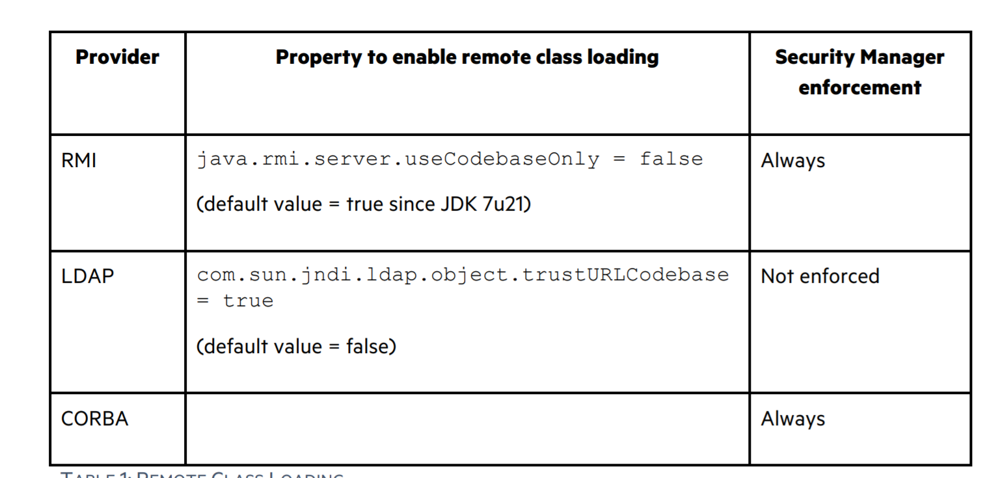

- [JNDI](#jndi)
  - [Naming Serivce](#naming-serivce)
  - [Directory Service](#directory-service)
  - [JNDI Naming References 命名引用](#jndi-naming-references-命名引用)
  - [CodeBase&Security Manager](#codebasesecurity-manager)
  - [JNDI注入](#jndi注入)
    - [动态转换](#动态转换)
  - [RMI](#rmi)
    - [JAVA RMI远程方法调用过程](#java-rmi远程方法调用过程)
    - [Stub获取](#stub获取)
    - [实例代码](#实例代码)
    - [JRMP](#jrmp)
    - [RMI Attack](#rmi-attack)
    - [打法总结](#打法总结)
  - [LDAP](#ldap)
  - [JNDI回显](#jndi回显)
  - [补丁](#补丁)
# JNDI
JNDI全称为Java Naming and Directory Interface,是一个允许客户端通过名称来寻找数据和对象的JAVA API,这些对象能够被存储在不同的命名或者目录服务中,包括以下几种:
* RMI(远程方法调用)
* CORBA
* LDAP
* DNS

## Naming Serivce
命名服务是一个实体来将名称和值联系在一个的实体,称为绑定,提供了一种途径使得可以使用lookup或者search操作来通过名称寻找一个对象.
## Directory Service
目录服务是一种可以存储和搜索目录对象的特殊命名服务,可以和对象的属性进行交互,其结构呈树状结构.
```java
import javax.naming.Context;
import javax.naming.InitialContext;
import java.util.Hashtable;

public class JNDI {
    public static void main(String[] args) throws Exception{
        Hashtable env = new Hashtable();
        env.put(Context.INITIAL_CONTEXT_FACTORY,"com.sun.jndi.rmi.registry.RegistryContextFactory");
        env.put(Context.PROVIDER_URL,"rmi://x.x.x.x:1099");

        Context ctx = new InitialContext(env);
        ctx.bind("foo","test");


        Object localobj = ctx.lookup("foo");
        System.out.println(localobj);
    }
}

```
## JNDI Naming References 命名引用
为了绑定java对象在JDNI上,有时会使用JAVA序列化的字节数组来得到对象运行时的状态,但有时候数据过大或对象不适合这样这样绑定时就会使用References.

通过命名引用,对象可以在JNDI中绑定一个能被命名管理器解码的引用来指定原始的引用对象.

该引用由Reference类表示，并且由地址和有关被引用对象的类信息组成，每个地址都包含有关如何构造对象.

引用通过使用factory来构造对象,在构造中,该引用拥有factory类的地址,其通过lookup方法来从factory类的地址初始化被引用的对象,而且该factoy class支持从远程地址加载对象到目标系统
## CodeBase&Security Manager
在SPI层面,JVM虚拟机允许通过远程加载类,其中根据指定的协议不用来决定是否安装Security Manager.

但在命名管理器中,命名引用总是允许能够远程加载类,并且无JVM操作来关闭,并且不会强制安装Security Manager.
## JNDI注入
JNDI注入简单来说就是在JNDI接口在初始化时，如：InitialContext.lookup(URI)，如果URI可控，那么客户端就可能会被攻击.
* 只有Context是被`InitialContext`或者其子类(`InitialDirContext`,`InitialLdapContext`)初始化才可能被攻击.
* 一些InitialContext属性能够通过传递的地址或名称自动重写.
原因是`lookup`方法支持动态转换.
### 动态转换
`InitialContext.lookup`能根据传递的URL协议自动转换与设置了对应的工厂与PROVIDER_URL。如果设置了工厂与PROVIDER_URL,但lookup时参数能够被控制,也会优先根据lookup的协议进行动态转换.
## RMI
Remote methed Invocation,远程方法调用,远程服务器实现具体的Java方法并提供接口，客户端本地仅需根据接口类的定义，提供相应的参数即可调用远程方法并获取执行结果.
JAVA对RMI的实现为JRMP协议,Weblogic的实现为T3协议.
>1. RMI的传输是基于反序列化的。
>2. 对于任何一个以对象为参数的RMI接口，你都可以发一个自己构建的对象，迫使服务器端将这个对象按任何一个存在于服务端classpath（不在classpath的情况，可以看后面RMI动态加载类相关部分）中的可序列化类来反序列化恢复对象。
### JAVA RMI远程方法调用过程

通信流程:
1. Server端监听一个端口，这个端口是JVM随机选择的.
2. Client端并不知道Server远程对象的通信地址和端口，但是Stub中包含了这些信息，并封装了底层网络操作.
3. Client端可以调用Stub上的方法.
4. Stub连接到Server端监听的通信端口并提交参数.
5. 远程Server端上执行具体的方法，并返回结果给Stub.
6. Stub返回执行结果给Client端，从Client看来就好像是Stub在本地执行了这个方法一样.

在JVM之间通信时，RMI对远程对象和非远程对象的处理方式是不一样的，它并没有直接把远程对象复制一份传递给客户端，而是传递了一个远程对象的Stub，Stub基本上相当于是远程对象的引用或者代理（Java RMI使用到了代理模式.
### Stub获取
JDK提供了一个RMI注册表（RMIRegistry）来解决这个问题。RMIRegistry也是一个远程对象，默认监听在1099端口上，可以使用代码启动RMIRegistry，也可以使用rmiregistry命令.
调用关系:

所以服务端应用是有两个端口的，一个是RMI Registry端口（默认为1099），另一个是远程对象的通信端口（随机分配的），通常我们只需要知道Registry的端口就行了，Server的端口包含在了Stub中。RMI Registry可以和Server端在一台服务器上，也可以在另一台服务器上，不过大多数时候在同一台服务器上且运行在同一JVM环境下.
### 实例代码
Server:
```java
package com.company;

import java.rmi.Naming;
import java.rmi.Remote;
import java.rmi.RemoteException;
import java.rmi.registry.LocateRegistry;
import java.rmi.server.UnicastRemoteObject;

public class Main {
    public interface IRemotetest extends Remote {//继承java.rmi.Remote的接口,定义远程调用的函数,在这为test()
        public String test() throws RemoteException;
    }
    public class Remotetest extends UnicastRemoteObject implements  IRemotetest{//实现上面的接口类
        protected Remotetest() throws RemoteException{//构造函数
            super();
        }
        @Override
        public String test() throws RemoteException {//实现要调用的函数test()
            System.out.println("call test");
            return "call";
        }
    }
    private void start() throws Exception{//创建Registry,实例化上面的类,然后绑定到监听地址供客户端调用
        Remotetest  h = new  Remotetest();
        LocateRegistry.createRegistry(1099);
        Naming.rebind("rmi://127.0.0.1:1099/test",h);//在Registry注册实例化的对象绑定
        System.out.println("Listenning on 1099");
    }
    public static void main(String[] args) throws Exception {
	// write your code here
        new Main().start();
    }
}
```
Client:
```java
package com.company;

import java.net.MalformedURLException;
import java.rmi.Naming;
import java.rmi.NotBoundException;
import java.rmi.RemoteException;

public class client {
        public static void main(String[] args) throws NotBoundException, RemoteException, MalformedURLException {
            // write your code here
            Main.IRemotetest t = (Main.IRemotetest) Naming.lookup("rmi://127.0.0.1:1099/test");
            //使用Naming.lookup在Registry中寻找test对象
            //这里的类为定义接口的父类,而不是实现的子类类型
            String res = t.test();
            System.out.println(res);
        }
}
```
### JRMP
JRMP是JAVA对其RMI功能实现的协议.
正常JRMP协议流程:
1. 服务端A启动一个RMI的注册中心,并将要被远程调用的方法暴露在注册中心,其中存储着该方法的stub信息和该方法所处的ip地址和端口.
2. 客户端B连接服务端A启动的RMI注册中心,根据名称查询到对应的JNDI,并将其下回本地
3. 然后RMI通过下回来的数据得到对应方法的IP和端口,通过JRMP协议发起RMI请求

### RMI Attack
RMI远程对象也支持通过JNDI绑定在命令或者目录服务中,当调用lookup时,rmi客户端首先在本地的Classpath中来寻找该类,如果没有找到时则会通过远程对象来搜索该类的信息进行加载.
* RMI客户端启动会开启Sercurity Manager,并且拥有访问远程代码库的权限.
* java.rmi.server.useCodebaseOnly 属性要为false,在7u21后默认为True.
攻击流程:
1. 攻击者控制JNDI lookup方法的URL参数,注入恶意的RMI URL.
2. 服务器连接RMI URL指定的恶意RMI注册中心,RMI注册中心返回一个恶意JDNI引用.
3. 服务器解码JNDI引用得到工厂类的加载地址为攻击者的恶意服务器.
4. 从攻击者的服务器上寻找指定的工厂类.
5. 服务端初始化工厂类.
6. 该类中恶意的静态代码或者构造函数被执行触发RCE.

除了lookup,InitialContext.rename(),InitialContext.look upLink()同样受影响,因为其最后也是调用了lookup方法.

**利用条件:**
1. 未安装并配置SecurityManager.
2. Java版本低于7u21,6u45,或者设置了java.rmi.server.useCodebaseOnly=false,因为Java版本在7u21,6u45时官方将java.rmi.server.useCodebaseOnly的默认值由false改为了true.在java.rmi.server.useCodebaseOnly配置为true的情况下,Java虚拟机将只信任预先配置好的codebase.不再支持从RMI请求中获取.
### 打法总结
主要原理是RMI的双向传输都是反序列化,可以直接互相打反序列化漏洞或者通过JNDI引用.

1. 打Registry注册中心
通过使用Registry连接到注册中心，然后把gadget chain对象bind注册到注册中心，从而引起注册中心反序列化RCE

2. 打InitialContext.lookup执行者
通过使用JNDI的实现，也就是rmi或ldap的目录系统服务，在其中放置一个某名称关联的Reference，Reference关联http服务中的恶意class，在某程序InitialContext.lookup目录系统服务后，返回Reference给该程序，使其加载远程class，从而RCE

3. JRMP协议客户端打服务端
使用JRMP协议，直接发送gadget chain的序列化数据到服务端，从而引起服务端反序列化RCE

4. JRMP协议服务端打客户端
使用JRMP协议，当客户端连上后，直接返回gadget chain的序列化数据给客户端，从而引起客户端反序列化RCE


## LDAP
## JNDI回显

## 补丁
jdk8u121版本开始，Oracle通过默认设置系统变量com.sun.jndi.rmi.object.trustURLCodebase为false，将导致通过rmi的方式加载远程的字节码不会被信任.
绕过:
1. 使用LDAP替换
2. 使用tomcat-el利用链  

在在JDK 11.0.1、8u191、7u201、6u211之后 com.sun.jndi.ldap.object.trustURLCodebase属性的值默认为false,也限制了利用LDAP远程加载.
绕过:
1. 
2. 通过加载本地类
**参考:**  
https://paper.seebug.org/1091/#weblogic-rmi  
https://blog.csdn.net/li_w_ch/article/details/110114397  
https://xz.aliyun.com/t/7079
https://www.blackhat.com/docs/us-16/materials/us-16-Munoz-A-Journey-From-JNDI-LDAP-Manipulation-To-RCE.pdf