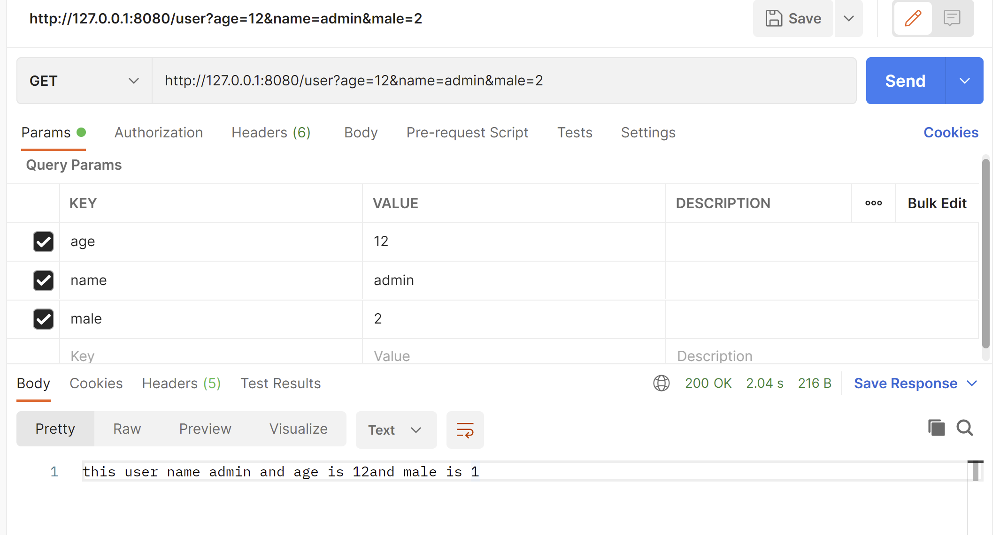

- [参数绑定漏洞](#参数绑定漏洞)
  - [参数绑定](#参数绑定)
  - [潜在漏洞](#潜在漏洞)
# 参数绑定漏洞

## 参数绑定
参数绑定是一种软件框架允许将HTTP参数直接和程序对象
字段做绑定的功能.
以Spring为例,Spring mvc的字段映射功能,如果传入的参数名称和接受参数对象的字段一致,则会尝试将用户输入的参数值自动绑定到参数对象对应的字段中,其原理在于如果参数类型为一个POJO对象(实现了setter和getter方法的类),则会自动调用该对象的set方法使用HTTP传入的参数值进行赋值.  
测试代码:
```java
package com.test.Controller;

import entry.User;
import org.springframework.stereotype.Controller;
import org.springframework.web.bind.annotation.RequestMapping;
import org.springframework.web.bind.annotation.ResponseBody;


@Controller

public class TestController   {
    @RequestMapping(value = "/test")
    @ResponseBody
    public String test(){
        return "test1";
    }
    @RequestMapping(value = "/user")
    @ResponseBody
    public String User(User user){
        return "this user name "+user.getName()+" and age is "+user.getAge()+"and male is "+ user.male;
    }

}


package entry;

public class User {
    public String name="polio";
    public int age = 20;
    public int male= 1;

    public void setAge(int age) {
        this.age = age;
        System.out.println("setAge invoke");
    }

    public String getName() {
        return name;
    }

    public int getAge() {
        return age;
    }

    public void setName(String name) {
        this.name = name;
        System.out.println("setName invoke");

    }
}
```
访问该路由,并传入该User类的name和age,male参数.

可以看到user类的name和age字段值自动变成了传入的值.  
控制台可以看到Spring自动调用了对应的字段的set方法

因为male字段并没有实现set方法或者并没有对该字段赋值.  
## 潜在漏洞
这种机制的漏洞点在于可能会造成参数污染或者变量覆盖.
添加admin字段表示是否为管理员,默认不为管理员,且该字段在用户表单中并不公开,但用户可能会传入该字段值导致该字段被修改,导致后续的业务逻辑受到影响.
```java
    public boolean admin =false;
    public void setAdmin(boolean admin) {
        this.admin = admin;
    }
    public boolean getAdmin(){
        return this.admin;
    }
```
如果是admin直接返回
```java
    public String User(User user){
        if(user.admin){
            return "this is admin";
        }
        return "this user name "+user.getName()+" and age is "+user.getAge()+"and male is "+ user.male;
    }
```

