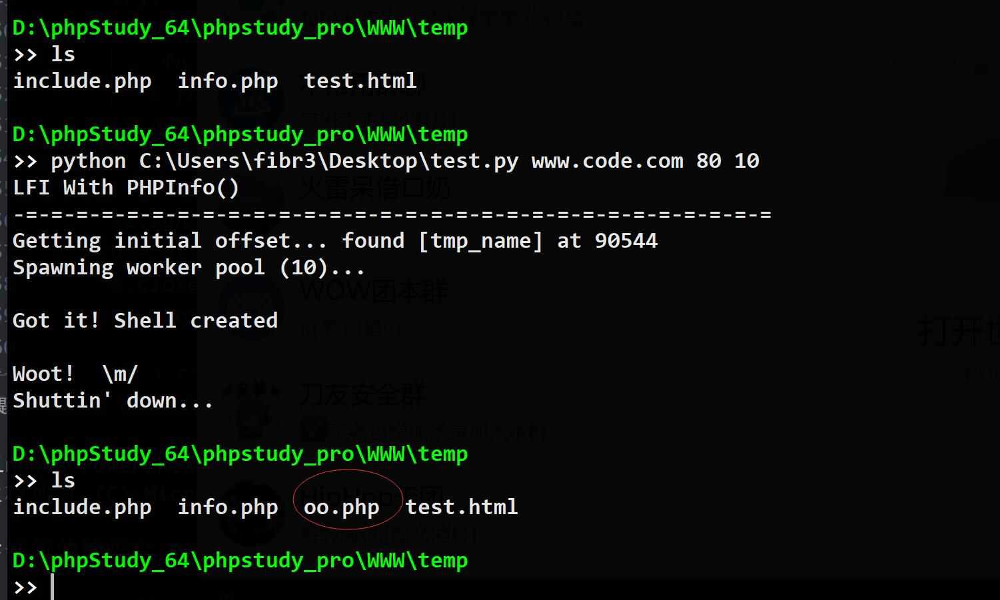
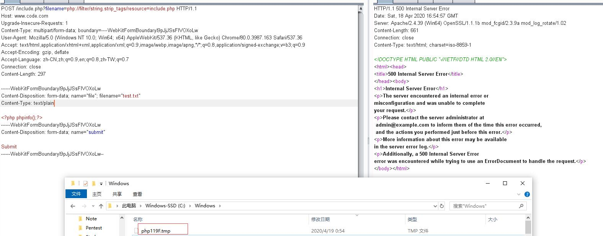

# **PHP临时文件包含Getshell**
## **phpinfo+临时文件包含**
条件:phpinfo()页面 php版本无限制
### **原理**
1. phpinfo()会动态输出当前脚本的所有全局变量
2. 当向phpinfo()页面发送post请求时,如果含有文件信息时,无论有没有处理文件上传的代码,php都会先在temp目录下先生成该文件的临时文件
3. 1和2结合可以则可以在向phpinfo()页面发送有文件信息的数据包之后在返回包中找到post文件时生成的临时文件的名字
4. 因为temp文件会在当前请求结束后就删除,所以构造畸形请求,使得返回包的大小超出php的缓冲区大小(4096),然后设置我们控制接收的socket每次读取大小为4096字节,在每个4096字节大小的数据包中来匹配temp文件的名字,因为php还在持续输出,所以此时脚本请求还未结束,所以temp文件还不会被删除
5. 匹配到之后则立刻发送文件包含的数据包,利用文件包含来包含该文件,使用file_put_contens()来在目标服务器生成一个webshell  
### **利用**
[利用脚本](https://github.com/vulhub/vulhub/blob/master/php/inclusion/exp.py),注意要修改在linux和window下文件名字长度不同的偏移量  

## **php7 Segment Fault**
条件:7.0 <= Version < 7.0.28,7.1.0 <= Version < 7.1.13, 7.2.0 <= version < 7.2.1
### **原理**
1. (CVE-2018-14884)php过滤器strip_tags会导致出现Segment Fault,会使垃圾回收机制失效,使得temp文件不被删除,永久保留
### **利用**
1.包含php://filter/string.strip_tags/resource=index.php,出现Segment Fault,垃圾机制失效,temp文件没有被删除

2. 爆破文件名....  
默认:  
linux: /tmp/php6位随机字符  
windosw: C:/Windows/php四个随机字符.tmp
3. 包含利用