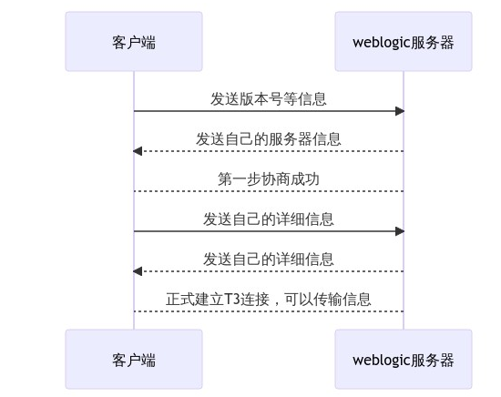
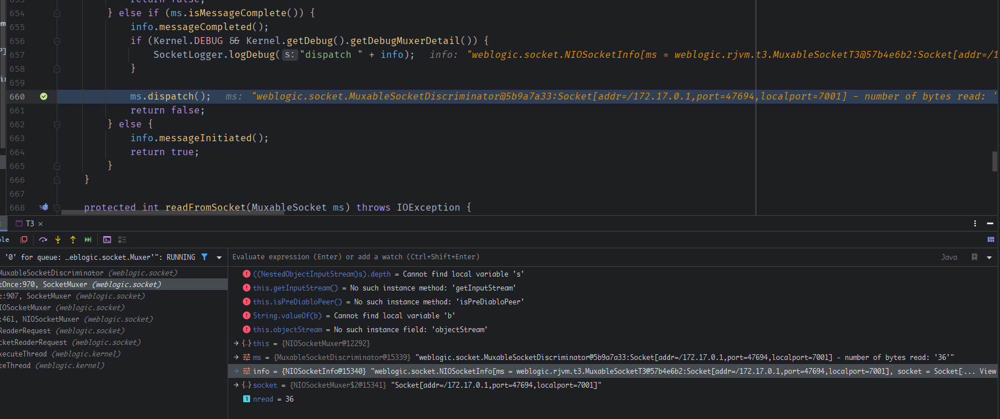
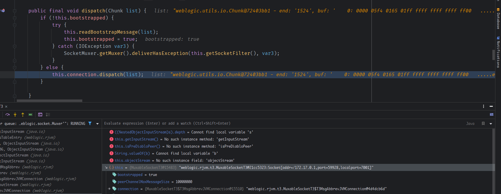
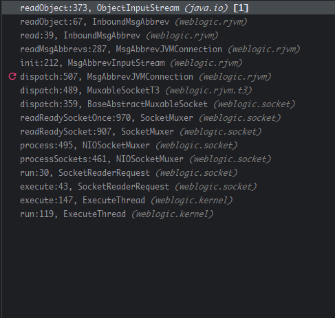
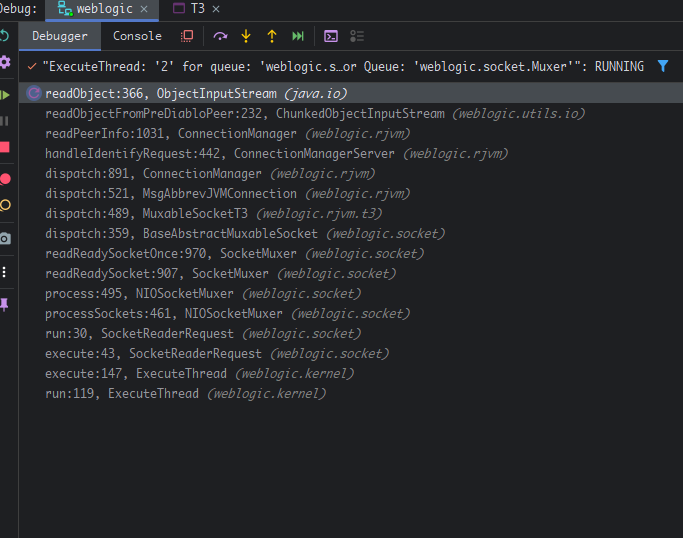

- [Weblogic T3\&IIOP协议](#weblogic-t3iiop协议)
  - [T3](#t3)
    - [InboundMsgAbbrev](#inboundmsgabbrev)
    - [MsgAbbrevInputStream](#msgabbrevinputstream)
  - [IIOP](#iiop)
    - [ValueHandlerImpl](#valuehandlerimpl)
# Weblogic T3&IIOP协议
## T3
Weblogic T3协议是Weblogic对RMI在Weblogic中的实现协议,在原生JAVA中RMI传输是使用JRMP协议进行传输,在Weblogic中使用RMI則是使用的T3协议,T3协议针对Weblogic主要是有一些特定的增强.
同样的在T3中传输对象也是用的序列化机制,同样可以进行反序列化攻击,T3协议大概的交互过程如下  
  
在T3协议的数据流中有几个序列化的部分,分别对应了代码中几个触发反序列化的点.
### InboundMsgAbbrev
常用的触发反序列化的地方点在于InboundMsgAbbrev类中,这也是第一个T3协议中最先触发反序列化的地方.    
首先客户端和服务端建立socket连接后,会调用SocketMuxer的`dispatch()`方法.
  
进入dispatch()后读取协议为T3,并根据协议创建一个对应的`MuxableSocket`.
  
然后调用这个新T3 Socket的`dispatch`方法. 

进入`MuxableSocketT3`的`dispatch`方法
  
然后会初始化一些参数后来到`InboundMsgAbbrev`的`readObject`方法中,其中创建一个`ServerChannelInputStream`对象并调用其readObject()方法.
  
而`ServerChannelInputStream`类是一个继承了原生ObjectInputStream的输出流,从而触发反序列化.  
  
调用栈如下:  

### MsgAbbrevInputStream  
MsgAbbrevInputStream的触发主要是在readPeerinfo的时候,在`ChunkedObjectInputStream#readObjectFromPreDiabloPeer()`中当读取的前两个字节为不为4时,则会调用当前输入流的reabOject().  
  
而当前的inputStream()为`ChunkedObjectInputStream`的内部类`NestedObjectInputStream`,同样继承于原生的ObjectInputStream.
  
调用堆栈如下:  

## IIOP
IIOP协议(Internet Inter-ORB Protocol)是针对TCP/IP层实现的通用对象请求协议(GIOP),而对象请求是指一种分布式调用的服务,通过在对象间建立一个CS关系,ORB(Object Request Broker)做中介代理,然后客户端通过这个代理(ORB)来调用服务端对象的方法.  

简单来说,ORB即中间代理,而GIOP是ORB和客户端,服务端之间进行通信的通用协议,而针对不同的通信层又有不同的具体实现方式,而IIOP就是TCP/IP层的具体实现协议,而CORBA(Common ObjectRequest Broker Architecture)则是对ORB代理制定的一套标准的体系规范,这样可以让不同的应用都可以通过同一个ORB进行通信.  

根据CORBA规定,在通信过程中存在三个部分,客户端,服务端,中间代理,这个体系类似于RMI,中间代理(ORB)即类似于注册中心的作用.  
```java
import java.rmi.Remote;

public interface iiopServiceInterface extends Remote {
    public void say() throws java.rmi.RemoteException;
}

import javax.rmi.PortableRemoteObject;
import java.rmi.RemoteException;

public class iiopServiceImpl extends PortableRemoteObject implements iiopServiceInterface {

    /**
     * Initializes the object by calling <code>exportObject(this)</code>.
     *
     * @throws RemoteException if export fails.
     */
    public  iiopServiceImpl() throws RemoteException {
        super();
    }
    @Override
    public void say(){
        System.out.println("hi");
    }
}

    public static void main(String[] args) throws NamingException,RemoteException {
        Hashtable<String, String> env = new Hashtable<>();
        env.put(Context.INITIAL_CONTEXT_FACTORY, "com.sun.jndi.cosnaming.CNCtxFactory");
        env.put("java.naming.provider.url", "iiop://127.0.0.1:7001");
        InitialContext initialContext = new InitialContext(env);
        iiopServiceImpl iiopService = new iiopServiceImpl();
        initialContext.rebind("test",iiopService);
        Object ob = initialContext.lookup("test");
        System.out.println(ob.toString());

    }
```
其实现过程和RMI类似,但区别在于需要手动生成`skeletons`和`stubs`.  
  
`rmic -iiop iiopServiceImpl`.  

然后会得到`_iiopServiceImpl_Tie.class`和`_iiopServiceInterface_Stub.class`.

在weblogic中实现了RMI-IIOP,即把RMI和IIOP进行了一些结合,可以在RMI客户端中使用IIOP协议进行JNDI操作.  
### ValueHandlerImpl
同样IIOP协议也是通过序列化来传递数据,而触发反序列化的点在`ValueHandlerImpl#readValueData`方法中,最终会反射调用对象的`readObject()`.  
  
  